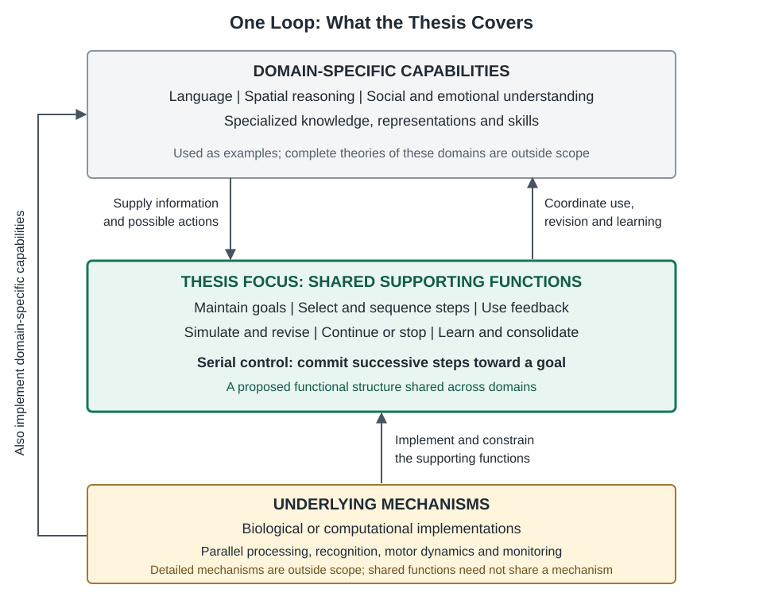
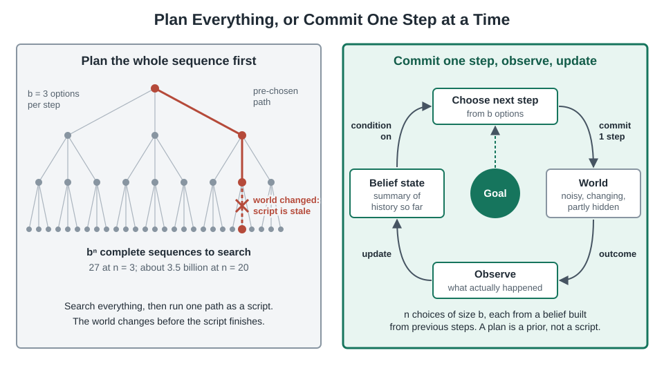
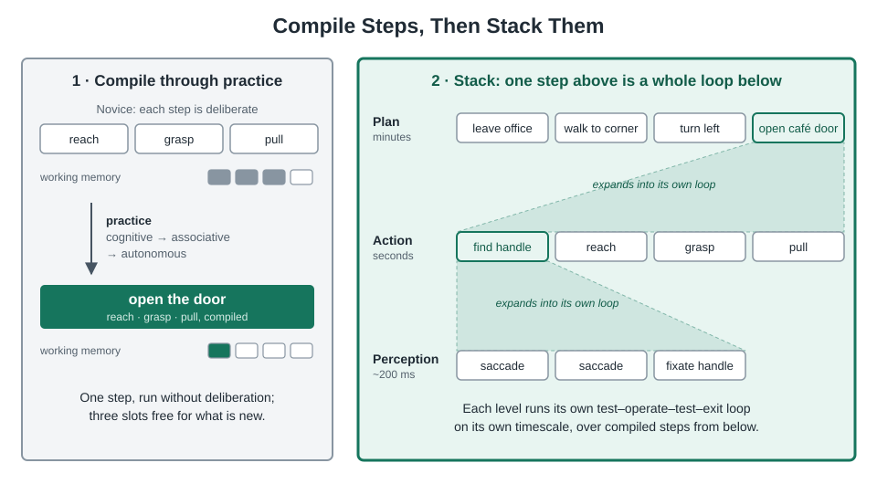

#  One Loop: Minds and Transformers

*About the logo: the goal sits at the center. The dashed inner loop is reversible simulation and search; the solid outer loop is irreversible, committed steps. One step is drawn as a loop of its own, because every step is a lower-level loop.*

> At the level where behavior is committed step by step, perception, reasoning, planning, action and language share one functional structure: **a hierarchy of goal-conditioned control loops whose steps are compiled procedures**, chunked upward through practice. Each loop places a **reversible inner loop** (simulation, search, drafting) before **irreversible commitments**, and must solve a **stopping problem** using progress, uncertainty and surprise signals. Interruptions are absorbed to the extent that a **shielded goal** separates what informs the next step from what may change the goal. Experience becomes knowledge, and deliberation becomes skill, through **selective consolidation**; learning is most effective at the **edge of competence** under fading support. Transformers implement the generator and much of the procedural substrate well; whether they need the remaining functions as explicit modules, or will acquire them with scale, is an empirical question, settled by the tests in II.6.

This article begins with observation, and then looks at the thesis from two directions:

- **Part I: first principles.** Start from constraints that any agent faces, and derive what its structure must look like. Humans and transformers serve as evidence, not as premises.
- **Part II: the builder's perspective.** Turn each principle into a component, a design rule, a build order and a test that could prove it unnecessary.


## Contents

- [0. The observation](#0-the-observation)
- [Part I: First principles](#part-i-first-principles)
  - [I.1 Too many futures to plan in advance → commit one step at a time and use feedback](#i1-too-many-futures-to-plan-in-advance--commit-one-step-at-a-time-and-use-feedback)
  - [I.2 Limited compute and memory → compile steps into procedures, and stack them](#i2-limited-compute-and-memory--compile-steps-into-procedures-and-stack-them)
  - [I.3 Some outputs can't be taken back → put a reversible inner loop in front](#i3-some-outputs-cant-be-taken-back--put-a-reversible-inner-loop-in-front)
  - [I.4 Thinking costs → a stopping problem → control signals](#i4-thinking-costs--a-stopping-problem--control-signals)
  - [I.5 The context mixes sources → the goal must be shielded](#i5-the-context-mixes-sources--the-goal-must-be-shielded)
  - [I.6 Learning fast overwrites old knowledge → separate memories and consolidate](#i6-learning-fast-overwrites-old-knowledge--separate-memories-and-consolidate)
  - [I.7 Learning signal lives at the edge of competence → development has an order](#i7-learning-signal-lives-at-the-edge-of-competence--development-has-an-order)
  - [I.8 The analogy makes predictions about humans](#i8-the-analogy-makes-predictions-about-humans)
  - [I.9 How far the derivation goes](#i9-how-far-the-derivation-goes)
    - [A. Well supported](#a-well-supported)
    - [B. Plausible, needs testing](#b-plausible-needs-testing)
    - [C. Speculative](#c-speculative)
- [Part II: The builder's perspective](#part-ii-the-builders-perspective)
  - [II.1 From principles to requirements](#ii1-from-principles-to-requirements)
  - [II.2 Architecture](#ii2-architecture)
  - [II.3 Design rules](#ii3-design-rules)
  - [II.4 Build order](#ii4-build-order)
  - [II.5 Where transformers stand](#ii5-where-transformers-stand)
  - [II.6 Validate before you keep: the bitter lesson](#ii6-validate-before-you-keep-the-bitter-lesson)
    - [P6: Does each module add value beyond scale? (claim 12)](#p6-does-each-module-add-value-beyond-scale-claim-12)
    - [P5: Does capability order matter? (claims 11 and 14)](#p5-does-capability-order-matter-claims-11-and-14)
    - [Feasibility and order of work](#feasibility-and-order-of-work)
- [References](#references)


## The observation

Many human processes seem to share a structure with transformer next-token generation:

1. **Perception** unfolds through successive observations, guided by what we are trying to find out. Our eyes make rapid shifts called saccades; each shift draws on what we have seen so far. We stop looking when we have enough information or something interrupts us.
2. **Reasoning** develops thought by thought toward an answer. Each thought builds on earlier ones, sometimes revisiting or correcting them, until we reach a conclusion or are interrupted.
3. **Planning** develops a course of action step by step. Each choice shapes the next, and later considerations may lead us to revise earlier choices.
4. **Execution and navigation** turn intentions into successive decisions. A plan or map provides direction, while each next step responds to our current situation and what happened before.
5. **Physical action** often begins with an intended outcome rather than a fully specified sequence of movements. Each movement adjusts to the effects of preceding movements and incoming sensory feedback.
6. **Talking and writing** unfold word by word. We may know what we want to express without having chosen every word; the wording develops as we proceed, with opportunities for correction and revision.
7. **Transformers** generate outputs token by token, conditioned on the available context and previously generated tokens. These outputs can represent text, speech, audio, video, or actions. Generation ends when a stopping condition is met, and new information added to the context can redirect subsequent output.

All of these have goals, run sequentially with or without backtracking, end in a conclusion or an interruption, and handle interruptions and off-track events by attending to relevant information and ignoring irrelevant information.

All seven processes can be written as a policy:

$$
\text{next step} = f(\text{goal}, \text{everything so far})
$$

This is what a transformer computes. It's also how agents work in reinforcement learning, and how predictive processing describes the brain.

Handling interruptions is the most interesting part. In a transformer, being interrupted just means new tokens enter the context and the next step adapts. Human action works the same way: a sensory surprise changes the next step without throwing away the whole plan.

##### **Comparisons between minds and transformers**

- **Goal**: whatever conditions the sequence toward an end state. It may be set from above, triggered by the environment, driven by needs or curiosity, or **reconstructed after the fact**.
- **Step**: a committed output at a given level of the hierarchy. For perception, reasoning, planning, action and speech, any sequence can be factored as p(x₁…xₙ) = ∏ p(xₜ | x₍<ₜ₎), and the shared mechanism works as general next-step predictor, plus attention over history.
- **Step is not planned beforehand**: the full sequence is not *explicitly represented* in advance. The internal state can still carry *implicit look-ahead*: speech errors show that later words are already active; hippocampal "theta sweeps" alternate between possible futures about eight times a second (I.6); LLMs choose a rhyme before writing the line. So the two are compatible: steps are generated on the fly, but the state looks ahead.
  - Lashley's *The Problem of Serial Order in Behavior* (1951) argued that behavior can't be pure chaining.
  - Speech errors show that people already hold later words in mind before saying them. Anticipation slips ("a leading list" for "a reading list") and spoonerisms are the evidence.
  - The next saccade target is computed during the current fixation.
  - Interpretability research found that LLMs pick a rhyme word before writing the line that ends in it.
- **Backtracking means different things in different cases.** Neither speech nor a transformer can erase what it has produced; both "backtrack" by appending a repair ("uh, I mean…", or "Wait, …" in reasoning models). Writing with editing, and mental backtracking in reasoning, really can revise earlier output. That is closer to search, or to diffusion-style refinement, than to pure autoregression. Which one appears depends on reversibility (I.3).


##### **Contrasts between minds and transformers**

- **Memory architectures differ.** Human working memory holds about four items. People compress history into a running state and rely on external memory (notes, maps). That is closer to an RNN or state-space model than to a transformer that can attend back to its whole raw context.
- **Learning while acting.** A human's "weights" change during the task. A transformer's weights are frozen at inference, so anything it learns mid-task has to live in its context (I.6).
- **Grounded, closed-loop feedback.** Humans get a continuous sensory stream. A model gets feedback only when something is injected into its context, such as a tool result or a user message.
- **Felt salience.** Emotion and body state decide what is relevant and when to stop. Goals persist as motivation and body state (Damasio), and stopping is a felt sense of satisfaction or "done." In a transformer, the goal is just conditioning text and stopping is an end-of-sequence token (I.4).
- **Offline simulation.** Humans can mentally rehearse a plan before acting. Reasoning models approximate this with hidden thinking tokens (I.3).
- **Hierarchy across timescales.** Humans nest goals → subgoals → actions → micro-movements, each running on its own timescale. A transformer is flat and has to learn any hierarchy implicitly (I.2).


# **Scope**



This thesis examines the **supporting functions** that organize intelligent activity across domains: committing one step at a time using feedback, compiling steps into nested procedures, simulating and revising before committing, deciding when to continue or stop, maintaining and shielding the goal, consolidating learning selectively, and learning at the edge of competence (I.1–I.7). Domains such as language, spatial reasoning, and social or emotional understanding supply specialized knowledge, representations and skills; the supporting functions coordinate when and how those resources are used, revised and learned. For example, composing a sentence and navigating a route require different knowledge and skills, but both involve maintaining a goal, evaluating possible next steps and adjusting to feedback. Capable behavior depends on their interaction: a shared control structure alone does not explain competence in a particular domain. An operating system is a useful analogy: the supporting functions are the **kernel** (scheduling steps, handling interrupts, managing memory), the domains are **services** that run on it, and the underlying mechanisms are the **hardware**, which services reach only through the kernel. The analogy is about roles, not components: a kernel is one separate body of code, whereas whether these functions need explicit modules is left open (II.6).

The thesis focuses on the **serial control level** of behavior: the level at which an agent commits outputs one after another (gaze shifts, words, moves, decisions, actions) in pursuit of something. Domain-specific capabilities serve as examples, rather than subjects of a complete theory. This level runs on top of parallel, continuous machinery the document does not describe: fast feed-forward recognition, motor dynamics, background monitoring. It is a **functional** claim, not a claim that brains and transformers share a mechanism.

---


# Part I: First principles' perspective

Each section below follows the same pattern. It starts with a **constraint** that every agent acting in the world faces, derives the **consequence** that follows from it, and gives **evidence** from humans and machines that the consequence holds.

Any sequence can be factored as p(x₁…xₙ) = ∏ p(xₜ | x₍<ₜ₎), so step-by-step dependence alone is not the claim. The derivations below predict *specific* structure beyond that: structure an arbitrary sequence would not have.

## I.1 Too many futures to plan in advance → commit one step at a time and use feedback

**Constraints:**

- **Too many possible sequences.** With b options per step and n steps there are bⁿ complete sequences; they can't all be searched. Committing one step at a time turns that into n choices of size b. The chain-rule factorization is the only affordable way to produce long sequences.
- **The world is noisy and changes while you act**, so a fully precomputed open-loop plan goes stale. Control theory shows that closed-loop feedback beats open-loop planning under noise.
- **The world is only partly observable**, and acting is often the only way to find out more.
- **Memory and compute are limited**, so the full history can't be kept and reprocessed at every step.
- **Committed outputs come out one at a time.** There is one mouth, one gaze and one body position. Even if thinking runs in parallel, what gets committed must be serialized.

**Consequence:** Commit one step, observe, and generate the next step from an updated **belief state**: a summary of history sufficient for acting well. Under partial observability (formally a POMDP), the optimal action depends on exactly such a belief state. It is mathematically required that the next step depends on the previous steps; More precisely, the next step *depends on a belief built from previous steps*. Brains compress history into a running state; transformers keep the raw history and attend to it. These are two approximations of the same belief state (I.6). A plan or map can still guide the loop, but as a prior, not as a script.



**Why the processes of minds and transformers look alike.** The problem forces it. Step-by-step generation that conditions on history and absorbs interruptions is what any capable agent with limited compute, an unpredictable world and a goal ends up doing; it can't plan the whole sequence in advance, because too much would change before it finished. Brains and transformers may both have arrived at this loop because it is the only tractable solution, not by coincidence and not because they share a mechanism. The observation in the observation section is then a claim about the structure of sequential decision-making under uncertainty, not just a similarity between brains and AI. The strongest counter-argument, that LLMs inherited the structure from human text, is weighed in I.9.

**Evidence:**

- **Humans:** Saccades are information-gathering actions: each one is taken to gather information for the next decision. Under predictive processing, perception is active sampling to reduce prediction error, so a saccade sequence is generation too, and perception sits fully inside the loop rather than only feeding it. Motor control is closed-loop, and Todorov's optimal feedback control goes further: the motor system corrects only deviations that matter for the task and lets the rest go (the *minimal intervention principle*). Speech is produced incrementally, with implicit look-ahead.
- **Machines:** Engineered systems arrive independently at the same loop. Model predictive control plans over a short horizon, executes only the first step, observes and replans; this is how navigation (point 4 in Observation section) can follow a plan or map and still decide on the fly. AlphaZero searches ahead, commits one move and searches again. Transformers generate token by token, and an injected interruption simply becomes part of the next step's conditioning.
- **Biology without brains:** Bacterial chemotaxis runs the same run–sense–adjust cycle.


## I.2 Limited compute and memory → compile steps into procedures, and stack them

**Constraints:** Human working memory holds about four chunks. Deliberation is slow and costly.

**Consequence:** Steps that recur must be **compiled** into procedures that run without deliberation, and a sequence at one level must be **chunked** into a single step for the level above. The result is a hierarchy of loops, each on its own timescale.



The loop itself is a **TOTE unit** (Miller, Galanter & Pribram, 1960): *Test* the state against the goal, *Operate*, *Test* again, *Exit* when they match. Their main further claim was that TOTE units **nest**: hammering a nail is (lift hammer → strike), repeated until the nail is flush. So the seven processes of the observation section are better seen as **levels of one hierarchy** than as parallel processes, where each level's step becomes the goal of the level below:

```text
need (hunger)                         homeostasis, hours
 └ goal (get lunch)
    └ plan (go to the café)           planning, minutes
       └ navigation (turn left)       execution, seconds
          └ action (reach, grasp)     motor, ~100s of ms
             └ saccade (find handle)  perception, ~200 ms
   (talking and reasoning attach at any level)
```

Each level runs its own step-by-step loop on its own timescale. The brain has a matching layout: the prefrontal cortex runs from abstract goals at the front to concrete actions at the back (Koechlin; Badre). In AI terms this is hierarchical reinforcement learning, or the options framework (Sutton, Precup & Singh, 1999).

**Evidence: procedural memory.**

- **Definition:** Knowing *how* rather than knowing *that* (Ryle, 1949): skills, habits, motor programs, cognitive routines (reading, arithmetic, grammar) and perceptual skills, including expert saccade strategies. It is acquired by practice, hard to put into words ("we know more than we can tell": Polanyi), and very durable.
- **Procedural memory is a separate system:** The amnesic patient H.M. improved at mirror drawing over days with no memory of ever practicing it (Milner, 1962). In Squire's taxonomy, *declarative* memory is episodic plus semantic, and *non-declarative* memory is procedural, priming and conditioning. Semantic and procedural memory learn differently and belong in separate stores (I.6).
- **Formation.**
  - The **basal ganglia** learn which action fits which context, by reinforcement through dopamine prediction errors. With practice, control shifts from the goal-directed dorsomedial striatum to the habitual dorsolateral striatum (Yin & Knowlton, 2006).
  - The **cerebellum** learns **forward models** that predict an action's sensory consequences, along with fine timing and error-driven correction.
  - Skills move through stages (Fitts & Posner): **cognitive** (following explicit instructions; slow, effortful) → **associative** → **autonomous** (fast, parallel, no attention needed).
  - Declarative steps are **compiled** into single procedures (Anderson's ACT-R; Newell & Rosenbloom's chunking), and performance speeds up along the power law of practice.

**Why procedural memory is central to the thesis.**

- **It supplies the steps.** Every step in the seven processes is itself a procedure: a saccade program, the articulation of a word, a grasp, a familiar inference move, a turn on a known route. The loop composes procedures. Without them each step would need deliberation, and the combinatorial problem of I.1 would come back at full force.
- **It makes the hierarchy possible.** Chunking turns a sequence at one level into a single step at the level above: letters → words → phrases; reach + grasp + lift → "pick up the cup." This answers Lashley's (1951) problem of serial order: behavior isn't a flat chain, it's nested, and each level of the TOTE hierarchy runs over the compiled procedures of the level below. Higher-level thinking is affordable because lower levels are automatic.
- **It frees the controller and working memory.** Automatic skills run without supervision, so the four-item working memory and the controller can attend to what's new. That is how you can talk while walking, or plan while driving.
- **It is the destination of consolidation.** The deliberation → habit pipeline of I.6 (practice, Dyna, distillation) produces procedural memory. Planning is how you act before you have a skill; procedural memory is what planning leaves behind.
- **It supplies the predictions.** Cerebellar forward models predict what each action should produce, and the mismatch is the surprise signal the controller of I.4 relies on.
- **It covers perception and reasoning too.** Chess masters perceive positions as chunks (Chase & Simon, 1973), expert radiologists' saccades go straight to anomalies, and mathematicians apply proof moves automatically. Expertise in all seven processes is mostly procedural.
- **Its failure mode is habit capture.** A habit can fire after the goal has changed: salt in the coffee, driving to the old office (Norman; Reason's "action slips"). It is the internal version of utilization behavior (I.5). The controller must be able to veto a running habit (prefrontal inhibition, stop signals), so goal shielding works in both directions: against external distractors and against one's own habits.

**Machines: an inversion.** LLMs are mostly procedural memory. Grammar, reasoning patterns and coding style live in the weights as know-how, and next-token generation is itself a skill. But after deployment they can't acquire new procedures natively. Their three substitutes line up with Fitts & Posner's stages:


| Form                                       | Stage                                                         | Example                                                    |
| ------------------------------------------ | ------------------------------------------------------------- | ---------------------------------------------------------- |
| Instructions or skill documents in context | Cognitive: a novice reading the manual; slow, costs attention | Prompted procedures; skill files loaded by agent harnesses |
| Executable code and tools                  | Externalized automaticity: runs without deliberation          | Voyager's code-skill library; scripts; APIs                |
| Adapters or weights trained by practice    | Autonomous: true procedural memory                            | Fine-tuning or distillation from successful trajectories   |


The missing piece in LLM is **practice-driven compilation**: moving a procedure from the first row to the second and third automatically through repetition, with forward models and reliability estimates attached (R5).

## I.3 Some outputs can't be taken back → put a reversible inner loop in front

**Constraint:** Many commitments are **irreversible**: you can't unsay a word or unthrow a ball. Errors in them are costly.

**Consequence:** Wherever errors are expensive, the agent needs two loops:

- an **inner loop** of cheap, revisable simulation (refining, searching, backtracking) in imagination or on scratch paper;
- an **outer loop** of irreversible commitment to the world, one step at a time, with feedback.

What defines the inner loop is **reversibility**: its operations can be undone or compensated, and they preserve invariants. Thinking is the revisable space that evolved so we don't commit too early.

Step-by-step generation is forced where outputs are **irreversible commitments to an uncertain world**. Where outputs can be cheaply revised, **iterative refinement** appears instead: diffusion models refine a whole image in parallel, and humans do the same when sketching, editing an essay or imagining. So all seven processes in the Observation section run the same outer loop; what differs is how much revisable inner loop sits in front of each commitment. Transformers started as outer-loop-only machines, and much recent progress amounts to adding an inner loop.


**Mapping irreversibility onto the seven processes.** The deciding variable is how expensive it is to revise a step once it's out. As that cost rises, behavior moves from refinement toward strict step-by-step generation with repair. This also explains why backtracking shows up in some cases and not others.


| Case (Observation section) | What gets committed                    | Cost to revise                       | Resulting structure                                                                                                                  |
| -------------------------- | -------------------------------------- | ------------------------------------ | ------------------------------------------------------------------------------------------------------------------------------------ |
| 5. Motor action            | Muscle commands                        | Impossible: you can't unthrow a ball | Pure closed-loop, step-by-step generation                                                                                            |
| 6a. Talking                | Spoken words                           | Can't unsay, only repair             | Step-by-step, with appended repairs ("I mean…")                                                                                      |
| 4. Navigation              | Physical position                      | Costly: walking back takes time      | Step-by-step, MPC-style; backtracking is literal                                                                                     |
| 1. Perception              | Gaze (cheap) and interpretation (free) | Low                                  | Hybrid: saccades are sequential, but the percept is refined in parallel (a flipping Necker cube is the interpretation being revised) |
| 2. Reasoning               | Thoughts in working memory             | Low, but memory is tiny              | Sequential search with backtracking: a tree, not a chain                                                                             |
| 6b. Writing                | Text on a page                         | Nearly free                          | Refinement: drafts, edits, restructuring                                                                                             |
| 3. Planning                | Nothing yet                            | Free                                 | Most refinement-like: the whole plan gets rearranged                                                                                 |


**Advantages of reversibility:**

- **Free backtracking.** Search needs undo; chess engines make and unmake moves millions of times. The inner loop is cheap because its operations are reversible.
- **Verification by inversion.** Check addition with subtraction, decode(encode(x)) = x, round-trip tests, back-translation, cycle consistency, substituting a solution back into the problem. Undoing is often easier to check than doing.
- **Invariants.** Knowing what a transformation leaves unchanged compresses the world model, prunes search, and turns violations into high-value surprise signals: a violated invariant means a bug or a wrong belief. This is the cognitive counterpart of Noether's link between symmetry and conservation.
- **Composability.** Reversible operations with an identity form a group-like structure: they can be composed, inverted and re-associated. That is the basis of systematic generalization.

**How much inner loop?** Roughly *(cost of an error) × (uncertainty) ÷ (time pressure)*.

- **High stakes and enough time**, as with surgeons, chess masters or exams in pen: think more before committing.
- **Low stakes or time pressure**, as in casual talk or reflexes: commit fast and correct online.

**Evidence:**

- **Talking vs writing** is the cleanest natural experiment among the seven processes. The same person producing the same kind of output switches from incremental generation with appended repairs ("I mean…") to drafting and revision, purely because reversibility changes. Word processors made revision even cheaper, and writing became measurably less linear.
- **Piaget.** Thought *is* internalized action, and it becomes thought proper when its operations become reversible. He described two forms of reversibility:
  - **inversion** (negation): undo the operation; +A − A = 0; pour the water back;
  - **reciprocity** (compensation): a change in one dimension offset by another; taller but thinner; A < B ⇔ B > A.
  - At the concrete stage these work separately; at the formal stage they combine into a single system, the **INRC group** (Identity, Negation, Reciprocal, Correlative). Conservation tasks reveal the shift. Water is poured from a wide glass into a tall, thin one:
    - The **preoperational** child says "more now, it's higher." It judges by the end state (*figurative* knowledge) and fixates on one dimension (centration).
    - The **concrete** child says "the same," with three justifications: **identity** (nothing was added or taken away), **inversion** (you can pour it back) and **compensation** (taller, but thinner). It reasons about the transformation, not just the states (*operative* knowledge).
  - Each justification is also a way for an agent to check its own work: identity becomes a diff audit, inversion a round-trip test, and compensation a conservation check (R3).
- **How reversibility develops.** Piaget traced it from action to thought:
  - **Sensorimotor, practical reversibility:** the infant can physically return to a starting point and take detours (the "practical group of displacements").
  - **Concrete operations:** reversibility is internalized; undoing is done mentally, on concrete things.
  - **Formal operations:** inversion and reciprocity are unified (INRC) and applied to hypotheses, as in reasoning with contrapositives and controlling variables in the balance and pendulum tasks.
  - The agent version follows the same path: learn undo as an action (git revert, rollback), then as internal simulation (forked contexts, invariant checks), then as formal reasoning over hypotheses ("if this fix is right, reverting it must bring the failure back").
- **Craik (1943).** The two-loop idea is old: the organism carries a "small-scale model" of the world so it can try alternatives before acting.
- **Machines.** Modern AI rediscovered both loops.
  - Reasoning models add private thinking tokens, a cheap-to-revise region ("wait, that's wrong…") before the irreversible answer.
  - Robot diffusion policies refine a short chunk of actions as a whole, execute it, then refine the next chunk: MPC with a refinement inner loop.
  - Diffuser (Janner et al., 2022) plans whole trajectories by refinement, matching the planning row of the table.

**Where transformers lack reversibility.** They are still partly preoperational.

- **Append-only thinking.** A reasoning model can't delete a wrong thought. "Wait, that's wrong" leaves the error in context, where it still primes later tokens. This is compensation, not inversion. Real inversion requires forking or rolling back the context, which tree-search harnesses provide (R2).
- **The reversal curse** (Berglund et al., 2023). Models trained on "A is B" often fail at "B is A," which looks like a failure of reciprocity in learned knowledge. The reading is weaker than it seems, though: models reverse relations fine when both are in context (I.9).
- **Conservation failures.** Entity and state tracking breaks down over long sequences of operations; video generators make objects appear, vanish or change count; counting fails after a transformation. These are classic preoperational errors: judging by surface state instead of tracking the transformation.
- **Verification by inversion helps.** Substituting a solution back into the original equation, or round-tripping a transformation, catches many LLM errors. It is an underused form of self-checking.


## I.4 Thinking costs → a stopping problem → control signals

**Constraint.** Each additional step of deliberation costs time, energy and opportunity.

**Consequence.** Every level reduces to one decision made over and over: think one more step, or act now? More fully, it must decide whether to *continue, deliberate, backtrack, switch or stop*. A good stopping rule has three parts:

1. a **confidence threshold**, which decides when to commit;
2. an **urgency signal** that lowers the threshold over time, so the agent doesn't stall;
3. a **surprise detector** that reopens the inner loop mid-execution. This is how interruptions get absorbed.

Humans get parts 2 and 3 cheaply from emotion and conflict monitoring. LLMs currently approximate them with external budgets and learned habits. The seven processes of section 0 may differ less in their generation mechanism than in how well this stopping rule is tuned for each one.

**Evidence.** Brains and models handle the decision in surprisingly parallel ways.

- **Accumulate evidence to a threshold** (the brain's basic mechanism). In the drift-diffusion model (Ratcliff; neural evidence from Shadlen), noisy evidence accumulates until it crosses a threshold, and then the agent commits.
  - A high threshold is slow and accurate; a low one is fast and sloppy. The speed–accuracy tradeoff is a single dial.
  - Under time pressure the threshold drops over time (an **urgency signal**), so the agent eventually commits even while unsure.
  - This approximates Wald's sequential probability ratio test, which is provably optimal for this kind of stopping problem.
- **Is another thought worth it?** (the rational account). Russell & Wefald's metareasoning and Lieder & Griffiths' resource-rational analysis give the rule: think one more step only if the expected improvement in the decision exceeds the cost of thinking (time, energy, missed opportunity). This is the formal version of I.3's *(cost of an error) × (uncertainty) ÷ (time pressure)*.
- **Detect conflict and escalate** (System 1 → System 2). The default is to commit fast. A conflict monitor (the anterior cingulate cortex) notices when something is off, such as competing responses, an error or a surprise, and reopens the inner loop. This is also how interruptions are handled: a surprise during execution reopens deliberation, the agent replans, and execution resumes.
- **Emotion supplies the cost signal.** In *Descartes' Error*, Damasio's patient Elliot had ventromedial prefrontal damage that cut off emotional signals. His logic was intact, but he could deliberate endlessly over trivial choices, such as which pen to use. On Damasio's account, emotion ("somatic markers") gives a fast value estimate that ends deliberation; without it, the inner loop doesn't know when to stop.

**Emotion as the control layer.** Every process in section 0 starts with a goal and stops at a conclusion or an interruption. The generator produces steps, but something has to set the goal, judge progress and declare it done. One answer is that emotion does that job.

- **Feelings report the body's state** (Damasio). Feelings are the mind's readout of homeostasis: how the body is doing relative to staying viable. A goal starts as a felt need. Somatic markers attach a fast, body-based value to options, so each one doesn't have to be worked out from scratch. The classic evidence, the Iowa Gambling Task, is contested: skin responses appeared before people could say which decks were bad, but Maia & McClelland (2004) showed participants knew more consciously than claimed. The functional idea has held up better than that experiment.
- **Predictive processing makes this precise.**
  - **Valence ≈ the rate of change of prediction error** (Joffily & Coricelli, 2013; a formal proposal, not an established result). Things getting better feels good; things getting worse feels bad. Valence is a progress signal.
  - **Arousal ≈ uncertainty or precision**: how much the current situation demands attention.
  - **Emotions as interoceptive inference** (Seth; Barrett): emotions are predictions about the internal state of the body.
  - On this view emotion is a **meta-signal about how the process is going**, not about its content, which is exactly what a stopping and escalation rule needs.

Mapped onto the decisions of the loop:


| Feeling                                   | Measures                                  | Control action                   |
| ----------------------------------------- | ----------------------------------------- | -------------------------------- |
| Curiosity                                 | Expected information gain                 | Keep exploring                   |
| Boredom                                   | Low gain, high opportunity cost (Kurzban) | Stop; go elsewhere               |
| Frustration                               | Stalled progress                          | Backtrack or switch strategy     |
| Anxiety                                   | Uncertainty × stakes                      | Raise the threshold; think more  |
| Surprise                                  | Large prediction error                    | Interrupt; reopen the inner loop |
| Fatigue                                   | Resources spent                           | Lower the threshold; finish up   |
| Satisfaction, "aha", feeling of rightness | Error resolved                            | Commit and stop                  |


Together these cover every control decision the seven processes need: start, continue, backtrack, switch, interrupt, stop. The generation mechanism can be the same across all seven, with emotion acting as the **shared controller**. The surprise signal itself comes from the procedural forward models of I.2.

**Machines.** Each brain mechanism has an LLM counterpart, and a gap:


| Brain mechanism                       | LLM counterpart                                                                 | Gap                                              |
| ------------------------------------- | ------------------------------------------------------------------------------- | ------------------------------------------------ |
| Threshold on accumulated evidence     | Token entropy or confidence; self-consistency voting                            | Models are often poorly calibrated               |
| Urgency signal                        | Thinking-token budgets; length penalties in reinforcement learning              | Imposed from outside, not felt                   |
| Conflict monitor reopens deliberation | "Wait, …" self-correction learned in reasoning RL                               | Emergent and unreliable                          |
| Somatic markers end deliberation      | Nothing intrinsic                                                               | Overthinking on easy problems, a lot like Elliot |
| Variable thought per step             | Fixed compute per token; adaptive computation (Graves 2016, PonderNet) is niche | Architecture limitation                          |


A telling result: in the *s1* paper (2025), suppressing the end-of-thinking token and appending "Wait" made models think longer and improved accuracy. That is essentially an external "are you sure?". The model had no internal sense of when it was done.

**What AI already has of the control layer:**

- **Dopamine ≈ reward prediction error** (Schultz, 1997), which is the TD error of reinforcement learning. This is the closest established match.
- **Curiosity bonuses** (ICM, RND) and **learning progress as intrinsic reward** (Oudeyer). Learning progress is almost exactly Joffily's valence.
- **Process reward models and value heads** score intermediate reasoning steps, a kind of progress signal.

What's missing is that these are mostly used **during training**. At inference time, an LLM agent has no running felt state that shapes its next step. II.2 sketches one.

## I.5 The context mixes sources → the goal must be shielded

**Constraint.** An agent's input mixes its own intentions, other people's instructions, things it observes, and its own habits. Any of these can push it toward a different goal.

**Consequence.** The goal must be **maintained** and **shielded**: information that *informs the next step* must be kept separate from information that *changes the goal*. Content can be mimicked, so shielding has to work by **source** and **salience**, not by content. Without a protected goal there is nothing to judge relevance against, and everything in context competes equally.

**What a goal is.** Every process in section 0 "starts with a goal," and that is the one part the loop itself can't explain. One answer: a goal is **a prediction the agent makes come true**.

- **Active inference.** Goals are prior preferences: the organism expects to be in viable states ("I'll be fed"). When reality doesn't match, the error can be resolved two ways: change the belief (perception), or change the world so the prediction comes true (action). Goals and beliefs are the same kind of object, distinguished only by **which side yields**.
- **Transformers work this way literally.** A prompt like "Here is a correct proof:" is a conditioning prefix, and the model generates a continuation in which the goal is achieved. The Decision Transformer (Chen et al., 2021) makes it explicit: condition on a desired future reward, and the model predicts the actions that would produce it. Goal-conditioning as prediction may be the deepest point of contact between the seven processes and the transformer.

**Goals also come from the bottom up.** Not every goal starts with a need. The environment suggests goals: you see a cup and want to pick it up (an **affordance**). Goals are also sometimes constructed after the fact (choice blindness; Gazzaniga's interpreter). Bottom-up goals are exactly what the prefrontal cortex has to shield the top-down ones from.

**Evidence: how the brain shields goals.**

- **Active maintenance with top-down bias.** The prefrontal cortex doesn't just store the goal: it holds it in sustained activity and continuously biases all other processing toward goal-relevant pathways ("biased competition"; Miller & Cohen, 2001).
- **A learned gate.** In the PBWM model (O'Reilly & Frank, 2006), the basal ganglia gate working memory. While the gate is closed, distractors can't overwrite the goal; it opens only when updating is warranted. Maintaining a goal and updating it are separate operations, controlled by a learned gate. O'Reilly's *Computational Cognitive Neuroscience* covers this in detail.
- **Source tagging.** The brain keeps track of where information came from: my intention, someone's instruction, something I saw. When source monitoring fails, as in some psychosis, inner speech is experienced as external voices.
- **A tunable tradeoff.** Too much shielding causes perseveration: frontal patients keep applying an old rule on the Wisconsin Card Sort after it stops working. Too little causes distractibility and utilization behavior. The setting moves with context: a fire alarm always gets through.

**When shielding fails, humans and agents fail the same ways:**


| Human failure                                                   | Agent failure                                      |
| --------------------------------------------------------------- | -------------------------------------------------- |
| Utilization behavior (frontal patients use any object they see) | Prompt injection                                   |
| Goal neglect (Duncan)                                           | Goal drift in long tasks                           |
| Habit capture                                                   | Repeating a learned pattern after the goal changed |
| Performing for approval                                         | Sycophancy                                         |


Frontal patients with utilization behavior (Lhermitte) pick up and use whatever is put in front of them, unprompted; text in the context grabbing the goal is the same failure. Healthy people with goal neglect know the rule but drift from it over a long task; so do LLM agents. Both suggest LLMs lack a strong goal-shielding mechanism.

**Why transformers struggle: the missing prefrontal cortex.**

- **Everything is one flat stream.** Instructions, documents, tool outputs and the model's own thoughts are all tokens in the same context. There is no privileged goal register.
- **The goal is re-inferred at every token** from the whole context. Its influence is just attention weight, which dilutes as the context grows. That causes goal drift.
- **There is no gate.** Any text in the context can act as an instruction. That causes prompt injection.

The LLM is like Leonard in *Memento*: with no working memory, his goals live only in notes and tattoos he rereads constantly, and anyone who can write on his notes can redirect him. R4 maps the available fixes onto the brain mechanisms above.

**The difference at the top.**


|                      | Human                               | LLM agent                                |
| -------------------- | ----------------------------------- | ---------------------------------------- |
| Top of the hierarchy | Homeostatic needs (intrinsic)       | User instruction (external)              |
| Standing preferences | Temperament, values, learned priors | Training dispositions, system prompt     |
| Subgoal generation   | Learned, automatic, multi-timescale | Mostly explicit (to-do lists, scaffolds) |
| Goal shielding       | Prefrontal cortex                   | Weak: prompt injection, drift            |


Not having intrinsic needs at the top is arguably a feature: it keeps an agent's goals anchored to a person (R7). The open engineering problems are in the **middle of the stack**, learned subgoal hierarchies and robust goal shielding, and neither requires giving the agent needs of its own.

So interruptions are absorbed with **graceful degradation, not robustness**: recovery depends on how well the goal was maintained (I.8).

**Back to section 0.** The observation said every process "attends to relevant information and ignores irrelevant information." This makes it precise. Relevance is defined *relative to a shielded goal*; without one, everything in context competes equally, which is the transformer's weakness. Humans handle interruptions well not because they attend to everything, but because a source-aware gate, tuned by salience, decides what may **change the goal** and what may only **inform the next step**. That distinction is probably the most useful practical takeaway for building agents.

## I.6 Learning fast overwrites old knowledge → separate memories and consolidate

**Constraint.** A distributed network that learns new things quickly overwrites what it already knew (*catastrophic interference*, McCloskey & Cohen, 1989; the stability–plasticity dilemma). LLMs have the dilemma in its pure form: fine-tune naively on today's session and you damage what the model already knew. And the optimal agent needs a belief state but cannot afford to keep, or re-read, everything.

**Consequence.** Use **separate stores** that learn at different speeds, and **consolidate** selectively from fast to slow:


| Store        | Kind                  | Brain                     | Role                                       | Learns by                                     |
| ------------ | --------------------- | ------------------------- | ------------------------------------------ | --------------------------------------------- |
| Working W    | Active                | Prefrontal cortex         | Goal stack and belief; small and protected | Gated updates                                 |
| Episodic E   | Declarative           | Hippocampus               | One-shot events, cue-based recall          | One-shot logging                              |
| Semantic M   | Declarative           | Neocortex                 | Gist, world knowledge, invariants          | Consolidation into gist                       |
| Procedural P | Non-declarative       | Basal ganglia, cerebellum | Skills: the steps of the loop (I.2)        | Practice, reward and error-driven compilation |
| Weights θ    | Substrate for M and P | Synapses                  | Long-term storage of knowledge and skill   | Slow distillation                             |


**Compress, or keep everything?** In a POMDP the optimal agent doesn't need the raw history, only the **belief state**: a summary sufficient to act optimally (formally, a probability distribution over hidden world states). "Later steps depend on previous steps" really means they depend on *a belief built from previous steps* (I.1). There are two ways to approximate it:


|          | Compress (recurrent)                                  | Keep everything (attention)                                                |
| -------- | ----------------------------------------------------- | -------------------------------------------------------------------------- |
| Update   | bₜ = f(bₜ₋₁, oₜ), fixed size                          | Re-read the raw history every step                                         |
| Examples | Kalman filter, RNN/LSTM, SSMs (Mamba), working memory | Transformer context                                                        |
| Strength | Constant cost; forces abstraction                     | Lossless; can reinterpret the past later                                   |
| Weakness | Loses what you didn't know would matter               | Cost grows with length; attention dilutes (lost in the middle, goal drift) |


**Evidence: the brain does both, in separate systems.**

- **Working memory** holds about four chunks (Cowan), actively maintained by the prefrontal cortex. This is the compressed recurrent state.
- **Episodic memory** in the hippocampus is fast, one-shot storage retrieved by cue: content-addressable, like attention. The parallel is formal: modern Hopfield networks are mathematically equivalent to attention (Ramsauer et al., 2020), and transformers with suitable position encodings reproduce hippocampal place and grid cells (Whittington et al., 2022). That is not evidence that the brain computes softmax attention.
- **The neocortex** learns slowly and statistically, corresponding to weights.
- **Consolidation** links them: Complementary Learning Systems (McClelland, McNaughton & O'Reilly, 1995). The hippocampus learns fast with sparse, well-separated codes, so new memories interfere little with each other; the neocortex learns slowly with overlapping codes that generalize; replay lets the cortex learn new experience interleaved with old, so nothing is overwritten.

So the brain is a hybrid: a small, actively maintained state, a large associative store, slow weights, and a transfer process between them.

- **Memory is generative too.** Bartlett (1932) showed that recall is reconstruction, not replay: retrieval is generation conditioned on cues, which is why memories distort. Remembering runs on the same loop as the seven processes of section 0, conditioned on a goal and cues. A transformer's context gives verbatim recall instead, which is more accurate but less abstract.
**Evidence: what sleep actually does.**
- **Time-compressed replay.** During deep (NREM) sleep, hippocampal sharp-wave ripples replay the day's sequences about 10–20× faster than real time (Wilson & McNaughton, 1994). Ripples coordinate with cortical spindles and slow oscillations to move the information into cortex.
- **Reverse replay at reward sites.** Sequences are played backwards from where reward occurred (Foster & Wilson, 2006). That is credit assignment, much like TD learning propagating value backward.
- **Replay of paths never taken.** Rats replay routes they never ran (Gupta et al., 2010). This is generative replay: the revisable inner loop of I.3, running offline.
- **Selection by tag.** Not everything is kept. Memories tagged by reward, emotion, surprise or expected future relevance are preferentially consolidated; people told they'd be tested later consolidate better (Wilhelm et al., 2011). Emotion is the tag, which ties consolidation to the controller of I.4.
- **Downscaling.** The synaptic homeostasis hypothesis (Tononi & Cirelli) holds that sleep globally weakens synapses, pruning noise and keeping the strong. Forgetting is part of consolidation, not a failure of it.
- **Schema integration and gist.** New information that fits an existing schema consolidates in days rather than weeks (Tse et al., 2007). Over time episodes become semantic gist: details fade, structure remains. This is compression into abstraction again (MDL).
- **REM recombination.** REM sleep mixes memories in new combinations and processes their emotional charge. Hoel's (2021) overfitted brain hypothesis, which is speculative, says dreams are noisy augmentation that prevents overfitting to the day.
- **The wrong things get consolidated too.** False memories are consolidated like true ones (Loftus). The agent version is R6's persistent injection.

**Evidence: replay as planning.** Remembering and imagining run on the same machinery.

- **Memory exists for the future.** Patients with hippocampal amnesia can't remember the past, and they also can't imagine new scenes in rich detail; their imagined experiences are fragmented (Hassabis et al., 2007). The constructive episodic simulation hypothesis (Schacter & Addis, 2007) explains why: memory is built to be recombined, and pieces of the past are reassembled to simulate possible futures. Remembering, imagining and planning are one generative process run on different inputs.
- **Theta sweeps: look-ahead at every step.** Within each ~125 ms theta cycle, place cells sweep ahead of the animal's current position. At a fork, consecutive cycles alternate between the possible futures, left, right, left (Kay et al., 2020). Even "on the fly" generation (section 0, point 1) contains a built-in micro-look-ahead, about eight times a second.
- **Vicarious trial and error.** Rats pause at choice points and swing their heads while hippocampal sequences run down each arm in turn (Johnson & Redish, 2007): deliberation as a visible mini-search.
- **Replay predicts the path.** Before moving, awake replay traces the route the rat is about to take to a remembered goal (Pfeiffer & Foster, 2013). The replay works as the plan.
- **Humans too.** MEG studies detect fast sequential replay in humans, including replay of abstract structure, not just places (Liu, Dolan, Kurth-Nelson & Behrens, 2019).
- **What gets replayed is optimized.** Mattar & Daw (2018) proposed that the brain replays the memory with the highest *gain × need*: how much replaying it would improve decisions, times how likely that state is to matter soon. The theory correctly predicts forward replay before decisions (planning) and reverse replay after reward (credit assignment). This is I.4's "is another thought worth it?" rule applied to *which memory to think about*: the controller decides not only whether to think, but what to simulate.
- **Habits vs planning: amortization.** Model-based planning is flexible but slow; model-free habit is fast but rigid. The brain arbitrates between them by which is more reliable at the moment (Daw, Niv & Dayan, 2005), which is the System 1 / System 2 controller of I.4 again. Practice converts planning into habit: repeated simulation is cached into fast responses (I.2). This is exactly Dyna, which uses simulated experience to train the fast policy. The LLM version distills chain-of-thought into direct answers, so what once required reasoning becomes intuition. Sleep replay is the brain's distillation step.


AI counterparts:


| Brain                                   | AI                                                                                                                     |
| --------------------------------------- | ---------------------------------------------------------------------------------------------------------------------- |
| Replay trains habits from a model       | Dyna (Sutton, 1990)                                                                                                    |
| Simulating futures in a learned model   | World models (Ha & Schmidhuber, 2018: "learning inside the dream"); Dreamer (a policy trained entirely in imagination) |
| Look-ahead at choice points             | MuZero: a learned model plus tree search, without being given the rules                                                |
| Theta-sweep alternation between options | Sampling several candidate continuations; tree-of-thought                                                              |
| Verbal simulation of outcomes           | LLM-as-world-model planning (e.g., RAP, 2023); reasoning tokens                                                        |
| Planning → intuition                    | Distilling reasoning traces into direct-answer models                                                                  |


A caveat: the hippocampus-as-planner evidence is strongest for spatial navigation in rodents. For abstract human planning it is growing but contested, and the prefrontal cortex clearly plays a large role too.

**One generative model, four uses.**


| Applied to           | It is called                                  |
| -------------------- | --------------------------------------------- |
| The past             | Remembering (reconstruction)                  |
| The present          | Perceiving (prediction plus saccade sampling) |
| The future           | Planning (simulation, theta sweeps, replay)   |
| Oneself in the world | Acting (predictions made true)                |


Offline, the same model produces the replay that trains the fast habit system. This is the deepest version of section 0's observation: the seven processes don't just resemble transformer generation; they may be **one step-by-step generative model of the world, pointed at different times and targets**. Transformers already are such generative models. What they mostly lack is not the generator but the **orchestration**:

- when to simulate instead of act;
- what to replay;
- when to cache simulation into habit;
- how to do all of it continuously across sessions.

**Is the small working memory a bug or a feature?**

- **Bug:** transformers beat SSMs at copying and exact retrieval (Jelassi et al., 2024). Rereading the past exactly is powerful.
- **Feature:** compression forces abstraction. A four-item limit makes you chunk, build schemas and find structure. Newport's (1990) "less is more" hypothesis holds that children's limited memory helps them learn grammar. This links to MDL and grokking: generalization comes from compression.

**Effect on interruptions.** After an interruption, a human rebuilds state from compressed memory and cues ("where was I?"): costly and error-prone, but the goal survives if it was shielded in working memory. For a transformer, an interruption costs nothing while it stays in context, since every token is still there; the risk comes later, when compaction or dilution erodes the goal (I.8).

**What transformer agents have.**


| Brain                                        | Transformer agent                                                                         |
| -------------------------------------------- | ----------------------------------------------------------------------------------------- |
| Working memory (small, maintained, shielded) | ✗: the context does double duty                                                           |
| Episodic store (cue-based retrieval)         | Context window + retrieval (RAG)                                                          |
| Slow weights                                 | Weights                                                                                   |
| Consolidation (sleep replay)                 | ✗ mostly: context is lost at session end; crude stand-ins are compaction and memory files |


Agents are reinventing Complementary Learning Systems one piece at a time:

- **Compaction** (summarizing old context) acts as compression into a working state.
- **Retrieval** acts as episodic recall.
- **Memory files** act as primitive consolidation.
- **Continual learning into weights** is the missing last step.

On the architecture side, hybrid SSM + attention models (Jamba, Samba) suggest the field is converging on the brain's split. AI has also borrowed pieces of sleep itself:


| Brain                         | AI counterpart                                                                                                  |
| ----------------------------- | --------------------------------------------------------------------------------------------------------------- |
| Hippocampal replay            | Experience replay in DQN (explicitly inspired by it)                                                            |
| Salience-tagged consolidation | Prioritized replay                                                                                              |
| Generative replay             | Generative replay for continual learning (Shin et al., 2017): regenerate old data to interleave with new        |
| Protecting important synapses | EWC (Kirkpatrick et al., 2017): penalize changes to weights that matter for old tasks                           |
| Offline simulation            | Dyna (Sutton, 1990): learn from model-simulated experience between real steps                                   |
| Episodes → gist               | Reflection in Generative Agents (Park et al., 2023): periodically summarize memories into higher-level insights |
| Offline pre-thinking          | Sleep-time compute (2025): process context while idle to pre-compute what future queries will need              |
| Moving into weights           | Context distillation; LoRA updates on session data                                                              |


**Learning from one example.** Everything above is about *keeping* what was learned. The harder question is how one example can teach anything general at all.

- **Humans do it routinely.** A child learns a new word from a single use (*fast mapping*, Carey & Bartlett, 1978). Adults can recognize and draw a new handwritten character after seeing it once, where standard neural networks needed thousands of examples (Lake, Salakhutdinov & Tenenbaum, 2015).
- **The prior does most of the work.** One example can't define a concept; it can only *choose* among hypotheses the learner already favors. Children assume a new word names a whole object and extend it by shape (the shape bias, Landau, Smith & Jones, 1988). Bayesian models of word learning show how a few examples rapidly narrow a hypothesis space the learner already has (Xu & Tenenbaum, 2007). Characters are learned from one example because they are parsed into strokes the learner already knows how to compose. Analogy does the same at a higher level: map the new case onto a familiar structure (Gentner, 1983).
- **Transformers do it in context.** Put one or a few examples in the prompt and the model generalizes from them with no weight change (Brown et al., 2020). This is the same mechanism as goal-conditioning and interruption: the example enters the context, and the next step is conditioned on it. Pretraining builds the prior; the context selects from it. In-context learning behaves like implicit Bayesian inference (Xie et al., 2022), can implement gradient-descent-like updates inside the forward pass (von Oswald et al., 2023), and relies on circuits such as induction heads that copy patterns from earlier in the context (Olsson et al., 2022).


So one-shot learning splits across the two speeds of this section:

1. **Fast: use the example now.** Hold it in the fast store (hippocampus; the context window) and generalize by attending to it. This works only as far as the prior already contains the right hypotheses.
2. **Slow: decide whether to keep it.** What an LLM learns in context disappears at the end of the session unless it is consolidated. Humans keep one-shot learning when it fits an existing schema, which is also when consolidation is fastest (Tse et al., 2007, above).

Where the two differ:

- **Humans learn from explanations, not just examples.** People ask *why* the example works and generalize the reason, not the surface (explanation-based learning). In-context learning often keys on surface format: models can still do well when the labels in the examples are randomized (Min et al., 2022), and results shift with example order (I.8).
- **Humans tag single events for keeping.** A surprising, rewarded or emotional one-off is stored and consolidated preferentially (selection by tag, above). LLMs weigh every token in context alike and have no mechanism for marking one example as worth keeping.
- **A correction is the most valuable one-shot lesson** (I.7). But one example is also the easiest way to learn the wrong lesson: a single misleading case, or an injected one, generalizes just as readily.

For an agent this suggests a pipeline: log the example verbatim in E; extract the rule it implies as an explicit *hypothesis*; check that hypothesis on the next cases where it applies; and let it through the consolidation gate (R6) into M or P only once it has held up. One example is enough to *act* on, and the inner loop can test it cheaply; it is rarely enough to *keep*.

**The design this implies** is the brain's memory system, with procedural memory kept separate from world knowledge:

1. a **small, protected working state** holding the goal and current belief, which is where the goal register of I.5 belongs;
2. a **large associative store** read through attention or retrieval;
3. **slow semantic knowledge** of the world;
4. a **procedural store** of compiled skills, the steps of the loop (I.2);
5. **consolidation** that moves what was learned during a session into lasting form, turning experience into knowledge and deliberation into skill.

Transformers have 2 and 3, and a huge built-in version of 4; agent scaffolding fakes 1, 5 and the acquisition of new skills. Getting these natively into the architecture would likely close the remaining gaps: goal drift, overthinking, and not learning from experience.

**The loop runs at three timescales**, each with its own form of backtracking:


| Timescale       | Loop                                          | Backtracking form                                      |
| --------------- | --------------------------------------------- | ------------------------------------------------------ |
| ms–seconds      | Committing steps (outer loop)                 | Repair ("I mean…")                                     |
| Seconds–minutes | Deliberation (inner loop)                     | Search; revising the draft                             |
| Hours–days      | Consolidation (offline loop over a whole day) | Reverse replay: credit assignment back through the day |


Sleep is the revisable inner loop applied to a whole day of experience. Today's agents mostly lack it, which is why they act within a session but don't learn across sessions.

## I.7 Learning signal lives at the edge of competence → development has an order

**Constraints.**

- Practice teaches nothing when a task always succeeds or always fails.
- Some capabilities can only be built on top of others.

**Consequences.**

- Learning happens in the **zone of proximal development** (ZPD): where success is possible but unreliable, under support that fades. In group-relative RL methods such as GRPO, problems that are always or never solved produce zero gradient, so this is the ZPD stated mathematically.
- Capabilities form a **dependency order**: forward models before planning, planning before verification, a shielded goal before safe autonomy. Piaget's stages, below, are one human realization of these dependencies, not a necessary order (I.9).

**Evidence.**

- **Piaget gives the mechanism** (Piaget & Inhelder, *The Psychology of the Child*, 1969).
  - Thought is internalized action: operations are actions carried out in the head.
  - Schemes are *assimilated* (applied) and *accommodated* (revised) under **equilibration**, a self-regulation driven by disequilibrium that is close to prediction-error minimization.
  - Development runs from sensorimotor, through semiotic and concrete operations, to formal operations. Each stage builds on and integrates the structures of the previous one, which gives the **dependency order** the rest of the thesis lacked: so far it described a mature agent.
  - **Four drivers of development:** maturation, experience with objects, social transmission, and equilibration, which Piaget considered the most fundamental. For an agent: architecture capacity, interaction with the environment, human teaching and data, and intrinsic self-regulation.
  - **Two kinds of experience:** *physical* (learning about objects) and *logico-mathematical* (learning about the coordination of one's own actions). The second is what self-reflection and self-play give an agent.

**Piaget already runs through the framework.** Most of his concepts have a counterpart in the earlier sections:


| Piaget                                                                                                        | Where it appears in the thesis                                                                              |
| ------------------------------------------------------------------------------------------------------------- | ----------------------------------------------------------------------------------------------------------- |
| Thought is internalized action                                                                                | The inner loop is the outer action loop moved inside (I.3); Piaget says this is how the inner loop develops |
| Schemes: repeatable, generalizable action patterns                                                            | Procedural memory: skills with triggers (I.2)                                                               |
| Assimilation: apply an existing scheme to a new situation                                                     | The fast path: running a habit or skill                                                                     |
| Accommodation: modify the scheme when it doesn't fit                                                          | Decompile → relearn → recompile (R5)                                                                        |
| Equilibration: self-regulation triggered by disequilibrium                                                    | The controller: surprise reopens the loop, satisfaction ends it (I.4); also active inference                |
| Circular reactions: repeat an action to reproduce its effect                                                  | Practice → skill compilation; learning forward models                                                       |
| Tertiary circular reactions: vary actions to see what changes                                                 | Curiosity / information gain                                                                                |
| Coordination of schemes (8–12 months): one scheme as the means to another's goal; intentionality appears      | TOTE hierarchy and chunking; the goal stack                                                                 |
| Invention through mental combination (~18 months): solving problems in the head instead of by trial and error | The inner loop; Craik's small-scale model; replay as planning                                               |
| Object permanence                                                                                             | The belief state: representing what is no longer perceived (I.1)                                            |
| Memory improves as schemes develop                                                                            | Reconstructive memory: recall is regenerated using current schemas (I.6)                                    |
| Perceptual activity: exploring, centering, comparing, maturing with age                                       | Saccades as active, skilled sampling                                                                        |
| Affect as the energetics of behavior, cognition as its structure                                              | Emotion as controller (I.4)                                                                                 |
| Reflective abstraction: abstracting structure from one's own actions                                          | Consolidation into gist; compression → abstraction (I.6)                                                    |
| Horizontal décalage: the same structure mastered in different domains at different times                      | LLMs' uneven ("jagged") competence                                                                          |


**What Piaget adds.**

- **Reversibility and conservation**, the biggest addition. Mature thinking requires operations that have inverses (pour the water back) and that preserve invariants (the amount stays the same). This makes I.3 precise: the inner loop is the domain of reversible operations, the outer loop the domain of irreversible actions. Mental reversibility makes backtracking free and allows verification by inversion.
- **The semiotic function.** Symbols, language, mental images, deferred imitation and pretend play give the inner loop a medium for representing absent things. Pretend play is safe simulation; deferred imitation is learning from a demonstration seen earlier.
- **Decentration.** Young children are *centered*, fixating on one salient dimension, and *egocentric*, unable to take another's perspective. Development is decentration. This adds perspective-taking and theory of mind, and puts source tagging (self vs other, I.5) on a developmental footing. LLMs anchoring on surface features is a form of centration.
- **Formal operations.** Hypothetico-deductive reasoning over possibilities, not just what is actual, plus thinking about one's own thinking. This is the mature form of the inner loop: systematic hypothesis search and metareasoning.
- **Caveats.** Infants show some competences earlier than Piaget thought (Baillargeon; Spelke's core knowledge), stages are less uniform than he claimed (décalage), and social and cultural learning matter more than he allowed (Vygotsky). Read the stages as a dependency order of capabilities, not fixed ages; core-knowledge priors can be built in at stage 0.

**Vygotsky gives the social source.** Piaget explains how the agent constructs its structures from its own action. Vygotsky explains where much of the content, the tools and the pace come from: other people.

- **Every higher function appears twice:** first between people, then inside the child. Attention, memory, planning and self-control all start as regulation by others and become self-regulation.
- **Mediation by tools and signs.** Language, numbers, writing, maps and mnemonics are psychological tools that transform the mental function itself: memory with a written note is a different function from memory without one.
- **Zone of proximal development:** the gap between what a learner can do alone and what they can do with help. Learning happens in that gap.
- **Scaffolding** (Wood, Bruner & Ross, 1976): support adapted to the learner's level and faded as competence grows.
- **From social speech to inner speech:** social speech → private speech (talking aloud to oneself) → inner speech (silent, abbreviated, condensed). Private speech increases with task difficulty.
- **Everyday vs scientific concepts.** Everyday concepts grow upward from experience; scientific concepts are systematic and grow downward from instruction. Development is where they meet.
- **Play creates its own ZPD:** in play, a child is "a head taller than himself."
- **Later work** extends this: shared intentionality and the cultural ratchet (Tomasello), legitimate peripheral participation (Lave & Wenger), and reasoning as evolved for argument (Mercier & Sperber).


**Vygotsky already runs through the framework:**


| Vygotsky                                                                                        | Where it appears in the thesis                                                                                                                                            |
| ----------------------------------------------------------------------------------------------- | ------------------------------------------------------------------------------------------------------------------------------------------------------------------------- |
| Private speech grows with difficulty, then goes underground                                     | Chain-of-thought: reasoning models think longer on harder problems. Distilling reasoning into direct answers, or latent "continuous thought," is speech going underground |
| Piaget vs Vygotsky on "egocentric speech": a symptom of egocentrism, or a self-regulation tool? | The same debate about whether chain-of-thought is real reasoning or decoration. The evidence favors Vygotsky: it regulates the process                                    |
| Functions move from social to individual                                                        | Thought as internalized action (I.3), but the source is dialogue: the inner loop is partly internalized argument, as in self-critique and multi-agent debate              |
| Other-regulation → self-regulation                                                              | The controller and goals start external: a parent's instruction, a user's goal. Self-regulation grows within those goals (I.5)                                            |
| Psychological tools                                                                             | External memory and scaffolding: notes, scratchpads, memory files, tools. Writing as an external context window (I.8)                                                     |
| Culture passes on compiled procedures (long division, reading)                                  | Procedural memory transmitted, not discovered: the cultural ratchet (I.2)                                                                                                 |
| Imitation works only within the ZPD                                                             | Piaget's deferred imitation, plus a limit on what can be imitated                                                                                                         |


**What Vygotsky adds.**

- **The ZPD is a formal training principle.** In group-relative RL methods such as GRPO, problems the model always or never solves give zero learning signal; only intermediate pass rates produce gradient. Oudeyer's learning-progress curiosity is an agent choosing its own ZPD.
- **Scaffolding fades.** Hints, partial plans, demonstrations, restricted tool sets and human approvals are support, and should fade as reliability grows. This ties directly to the reliability record of each skill in P (R5).
- **Scientific concepts meet everyday ones.** LLMs have the scientific concepts (systematic, verbal, from reading) without the everyday ones (grounded in their own action). Pretraining supplied the downward growth; Piaget's back-fill (II.4) is the upward growth; grounding is where they meet.
- **Shared intentionality** (Tomasello): joint attention, common ground, we-goals, teaching by pointing. For agents: track what both parties are attending to (the open file, the selected code), maintain common ground (what has been agreed), and plan *with* the user, not just for them. This requires the decentration and theory of mind of the Piaget stages.
- **Legitimate peripheral participation.** Newcomers start with low-risk peripheral tasks and earn responsibility. For agents, autonomy expands along the reversibility ladder (II.4), and scaffolding fades class by class.
- **A teacher's corrections are privileged signals.** A user's correction is the most valuable kind of interruption: it gets top trust at the goal gate (R4), top salience at the consolidation gate (R6), and becomes a lesson.

**Piaget and Vygotsky together:**


|                   | Piaget                                        | Vygotsky                                             |
| ----------------- | --------------------------------------------- | ---------------------------------------------------- |
| Learner as        | Scientist                                     | Apprentice                                           |
| Engine            | Action + equilibration                        | Social interaction + tools                           |
| Explains          | How structure is built                        | Where content, tools and pace come from              |
| Direction         | Development enables learning                  | Learning leads development                           |
| Agent counterpart | Self-practice, experimentation, consolidation | Demonstrations, feedback, curricula, cultural priors |


An agent needs both: self-construction for grounding and structure, social scaffolding for content and speed.

**Learning by watching: imitation.** Piaget and Vygotsky both mention imitation in passing, but it may be the main channel through which humans and LLMs acquire their content.

- **Pretraining is imitation.** Next-token prediction on human text is behavior cloning on the written record of human sequential behavior: speech, argument, worked solutions, thinking set down on paper. The generator of this thesis was learned largely by imitating people. That sharpens claim 13: if LLMs learned by copying humans, their resemblance to humans is the expected outcome and says little about whether the loop is a general solution.
- **Good imitation copies the goal, not the movements.** Eighteen-month-olds who watch an adult *fail* to pull a toy apart still pull it apart: they reproduce the intended act, not the observed one (Meltzoff, 1995). Infants who see an adult switch on a light with her forehead copy the odd action when her hands were free, but use their hands when hers were wrapped in a blanket: they infer *why* she did it that way (rational imitation, Gergely, Bekkering & Király, 2002). Imitation is goal inference followed by one's own steps toward the goal, which ties it to the goal machinery of I.5.
- **Faithful copying has a price.** When a causal mechanism is hidden, children copy even the demonstrator's useless steps, which chimpanzees skip (overimitation, Horner & Whiten, 2005). High-fidelity copying of steps one doesn't understand is what lets cultures pass on procedures nobody could reinvent (the cultural ratchet, Tomasello), and it is also how quirks and errors get passed along. LLMs show both sides: they inherit compiled human procedures, and also human filler, biases and mistakes.
- **Imitation alone compounds errors.** A cloned policy has seen only the states the expert visited. One mistake takes it somewhere the demonstrations never went, and errors grow with the length of the task (Ross, Gordon & Bagnell, 2011). This is the exposure bias of I.8 and R2. The fix is to close the loop: DAgger has the expert label the states the *learner* actually reaches, and RL on a model's own outputs (RLHF, verifiable rewards) trains on its own trajectories. Humans learn the same way: watch a demonstration, then practice while a coach corrects your attempts, not the coach's. Imitation supplies the prior, and feedback on one's own steps repairs it.
- **Imitation is bounded by the ZPD.** You can imitate only what you can almost do already (Vygotsky). A few-shot prompt is imitation in the fast store: the demonstration sits in context and the model follows it (I.6, learning from one example).

The human forms of imitation each have a machine counterpart:


| Human                                              | Machine                                                                      |
| -------------------------------------------------- | ---------------------------------------------------------------------------- |
| Copy the movements (mimicry)                       | Behavior cloning; next-token pretraining                                     |
| Copy the outcome by any means (emulation)          | Goal-conditioned imitation; hindsight relabeling (Andrychowicz et al., 2017) |
| Infer the intention, then act (rational imitation) | Inverse RL (Ng & Russell, 2000); apprenticeship learning (Abbeel & Ng, 2004) |
| Copy steps whose purpose is opaque (overimitation) | Inheriting human quirks, biases and errors from training data                |
| Practice while a coach corrects your own attempts  | DAgger; RL on the model's own outputs                                        |


For an agent:

1. **Treat a demonstration as evidence about a goal.** Infer what the demonstrator was trying to achieve, then plan toward it; copy the exact steps only where the agent can't yet tell which ones matter.
2. **Follow imitation with corrected practice.** Let the agent attempt the task and have the user fix *its* attempts. Corrections on states the agent actually reaches are worth more than further demonstrations.
3. **Keep only what holds up.** A demonstrated procedure enters P as a skill through the consolidation gate (R6), like any other lesson, once the agent's own runs confirm it.


## I.8 The analogy makes predictions about humans

If humans and transformers both compute **next step = f(goal, everything so far)**, effects known in one should show up in the other. Several hold up:


| Prediction                                         | Humans                                                                                                    | Transformers                                                                        |
| -------------------------------------------------- | --------------------------------------------------------------------------------------------------------- | ----------------------------------------------------------------------------------- |
| What's earlier in context biases what comes next   | Order and priming effects: anchoring, framing                                                             | Prompt-order and example-order effects                                              |
| Writing steps down improves reasoning              | Thinking aloud or on paper gives an external context window beyond ~4 working-memory items                | Chain-of-thought                                                                    |
| Errors compound                                    | Garden-path sentences; getting lost after one wrong turn                                                  | Exposure bias; a wrong early step keeps priming later ones (R2)                     |
| Interruption recovery depends on surviving context | "Where was I?": resumption lags and switching costs (Altmann & Trafton) scale with goal maintenance (I.5) | Full recovery while the context is intact; drift once it is truncated or summarized |


Writing steps down is also Vygotsky's private speech (I.7): the external context window comes first, and its compression into inner speech comes later.

## I.9 How far the derivation goes

**Claims, graded by confidence.** Numbered so the tests in II.6 can refer to them.

### A. Well supported

1. **Serial control loop (I.1).** At the commitment level, perception (gaze), reasoning, planning, action and language each generate the next step conditioned on a goal and a belief built from history. Committing one step at a time with feedback is the tractable solution under huge option spaces, noise, partial observability and limited memory, which is why engineered systems (MPC, game search) arrive at it too.
2. **Hierarchy through procedural compilation (I.2).** Steps at each level are compiled procedures. Practice turns deliberation into skill, and chunking turns a sequence at one level into a single step for the level above. That makes deep hierarchies affordable and frees working memory and control.
3. **Two loops, separated by reversibility (I.3).** A revisable inner loop (simulation, search, drafting) sits in front of an irreversible outer loop (commit, then feedback). Inner-loop operations can be undone or compensated and preserve invariants, which allows cheap backtracking and verification before commitment. How much inner loop precedes a commitment scales with the cost of error, uncertainty and time available.
4. **The stopping problem (I.4).** Every level must decide whether to continue, deliberate, backtrack or stop. Good solutions combine a confidence threshold, an urgency signal that lowers it, and a surprise signal that reopens deliberation.
5. **Goal maintenance determines interruption handling (I.5).** Interruptions are handled with graceful degradation, not robustness: recovery depends on how well the goal was maintained and shielded. Shielding must separate information that informs the next step from information that changes the goal, using source and salience rather than content.
6. **Consolidation (I.6).** Experience must be moved selectively from fast episodic storage into slow semantic and procedural knowledge without overwriting old knowledge, through replay, gist extraction and practice-driven compilation.
7. **Learning at the edge of competence (I.7).** Practice is most informative where success is possible but unreliable, under support that fades.


### B. Plausible, needs testing

1. **Thought is partly internalized action and dialogue (I.3, I.7).** The inner loop develops by moving action (Piaget) and dialogue (Vygotsky) inside. Chain-of-thought is private speech, and its compression into latent reasoning is inner speech.
2. **One generative model, several uses (I.6).** Remembering, perceiving, planning and acting may share one generative world model run in different modes. This is strongest in rodent navigation and less certain for abstract human planning.
3. **Control signals (I.4).** Progress, uncertainty, information gain, budget and surprise are the signals a controller needs. Emotions are their biological implementation, failure modes included; the engineering claim doesn't depend on calling them emotions.
4. **Capability dependencies (I.7).** Some capabilities require others: forward models before planning, planning before verification, a shielded goal before safe autonomy. Piaget's stages are one human realization of these dependencies, not a necessary order.


### C. Speculative

1. **Agents need these functions as explicit modules.** They might instead emerge from scale. Each module is a hypothesis about a function, kept only if it beats a larger plain baseline (II.6).
2. **Convergence vs inheritance.** Some parallels between LLMs and human cognition may be inherited from human text rather than convergent. Claim 1's generality rests on evidence from agents trained without human data, not on LLM resemblance.
3. **Grounding back-fill.** LLM agents may benefit from building lower-level competences in their own action domain (tool forward models, compiled skills, invariant-based verification). In symbolic domains such as code, this may turn out to be easy or unnecessary.

**Stress test: weak points, most serious first.** Each comes with what it costs the thesis and how to repair it.

1. **Unfalsifiability risk** (most serious). "One step-by-step loop" fits any sequential process, by the chain rule. The framework then took in emotion, memory, Piaget, Vygotsky and sleep, each mapping an analogy chosen after the fact, and a frame that absorbs everything predicts nothing. *Repair:* commit to predictions that could fail. I.8 lists predictions that already hold, and II.6 lists P1–P7, which could fail.
2. **Same description is not same mechanism.** Several processes aren't naturally discrete or serial. Fast object recognition takes about 100 ms through a mostly feed-forward sweep with no saccade sequence (Thorpe et al., 1996). Motor control looks like continuous neural population dynamics (Shenoy; Churchland), not emitted tokens. The brain is massively parallel: walking, talking and monitoring run at once. The serial loop may describe only the serial bottleneck (conscious access and committed outputs, as in Global Workspace theory), and "step" may be a level of description we impose. *Repair:* the claim is narrowed to committed, goal-directed sequences, the serial control level that sits on top of parallel, continuous machinery (Scope, section 0).
3. **"Everything starts with a goal" is shaky.** Much behavior isn't goal-initiated: habits, exploration, play, mind-wandering. Goals are often constructed after the fact: in choice blindness people defend choices they never made (Johansson & Hall, 2005), and Gazzaniga's split-brain "interpreter" invents reasons for actions it didn't cause. "Goal first" may partly be retrospective narration of a process that began bottom-up. *Repair:* treat goals as one source of conditioning among several (affordances, drives, curiosity, habits), sometimes inferred afterwards (the definition of goal in section 0; I.5).
4. **"Handles interruptions well" is overstated.** Humans are bad at interruptions: there is a measurable resumption lag, switching costs, and errors after interruption (Altmann & Trafton's memory-for-goals model). LLM agents degrade too. What is true is that both can recover, at a cost that depends on how well the goal was maintained. That supports goal shielding but contradicts section 0's original framing. *Repair:* claim graceful degradation, not robustness (I.5).
5. **The bitter lesson against the architecture** (the most serious practical objection). The design has ten or more modules: goal register, controller, gates, procedural store, sleep cycle, curriculum. It closely resembles classic cognitive architectures (Soar, ACT-R), which were insightful but did not scale, and hand-designed structure tends to lose to general methods plus scale (Sutton). Some modules may emerge inside a large trained model or prove unnecessary. *Repair:* treat modules as hypotheses about functions, not boxes to build; test each one's marginal value against a scaled-up baseline and drop those that don't earn their place (II.6).
6. **The developmental order may be contingent, not necessary.** Piaget's order may reflect human biology (slow motor maturation, a body that comes first) rather than logical dependency. LLMs show capabilities out of order and still work. For a coding agent the "sensorimotor" world is already symbolic, so back-filling may be trivial or unnecessary. And Piaget's stages are contested in their own field (Baillargeon, Spelke; décalage). *Repair:* claim only that some capabilities depend on others (forward models before planning, planning before verification), and test whether curriculum order matters (P5).
7. **Some cited evidence is weaker than presented** (see the evidence-status table below).
8. **Convergence vs inheritance is unresolved, and it matters.** Transformers are trained on human-produced text, a record of human sequential thinking, so LLMs may look human-like because they inherited the structure, not because I.1 forces it; then their similarity to human cognition says little about whether the loop is a general solution. Much of the AI side of the thesis quietly assumes convergence. *Repair:* lean on agents trained without human data, such as reinforcement-learning robots or AlphaZero. They still develop closed-loop, replan-every-step policies, which supports convergence. Label the language-specific parallels as possibly inherited, and rest the generality of the serial loop on evidence from agents trained without human data, not on LLM resemblance.
9. **Emotion framing.** The mapping picked the adaptive functions of emotion. Real emotions also bias, distort and misfire: anxiety spirals, mood-congruent memory, loss aversion. The functional signals don't need the emotion framing, and calling them emotions invites anthropomorphism. *Repair:* say "control signals, with emotion as the biological example" (I.4, II.2).
10. **Internal tension: "not planned beforehand" vs look-ahead.** The thesis says steps are generated on the fly *and* that the state carries look-ahead (theta sweeps, rhyme planning, MPC). These are compatible only if "planned" means *explicitly represented as a full sequence*, which is how section 0 defines it.

**What survives the stress test.**

- **Strong:** the serial control level of goal-directed behavior; the two-loop structure, with reversibility separating the loops; procedural compilation and chunking as the basis of hierarchy; the stopping problem; goal shielding; consolidation; the ZPD as a training principle.
- **Weaker:** claims of mechanism identity; "everything starts with a goal"; a fixed developmental order; several neuroscience parallels.

**Evidence status of cited claims.**


| Claim                                        | Status                                                                                                                                                                       |
| -------------------------------------------- | ---------------------------------------------------------------------------------------------------------------------------------------------------------------------------- |
| Somatic markers / Iowa Gambling Task         | Contested (Maia & McClelland, 2004); the functional idea holds up better                                                                                                     |
| Valence = rate of change of prediction error | A formal proposal, not established                                                                                                                                           |
| Overfitted-brain theory of dreams            | Speculative                                                                                                                                                                  |
| Hippocampal preplay                          | Debated                                                                                                                                                                      |
| Theta alternation; replay as planning        | Strong in rodent navigation; growing (MEG) but contested for abstract human planning                                                                                         |
| Reasoning evolved for argument               | Influential but debated                                                                                                                                                      |
| Attention ≈ hippocampus                      | Mathematical equivalence (Hopfield) and model-fitting results, not evidence that the brain computes softmax attention                                                        |
| "LLMs are preoperational"                    | A metaphor: LLMs pass many text conservation tasks, and their failures are inconsistent                                                                                      |
| Reversal curse as missing reciprocity        | Weaker than claimed: models reverse relations fine in context. The curse concerns how training stores facts, an asymmetry in storage, not an inability to reverse operations |


---


# Part II: The builder's perspective

The builder's question is: *given the principles in Part I, what do I build, in what order, and how do I know each piece is worth keeping?*

## II.1 From principles to requirements


| Principle                 | Required function                               | Component                                                  | Failure if missing                        |
| ------------------------- | ----------------------------------------------- | ---------------------------------------------------------- | ----------------------------------------- |
| I.1 Step with feedback    | Next-step generation from goal and belief       | Generator **G**; belief state                              | Stale open-loop plans                     |
| I.2 Compile and stack     | Reusable skills; hierarchy                      | Procedural store **P**; goal stack                         | Deliberating every step; no hierarchy     |
| I.3 Reversible inner loop | Simulate, backtrack, verify before committing   | Forkable **scratch**; action gate                          | Irreversible errors; append-only mistakes |
| I.4 Stopping problem      | Decide continue / deliberate / backtrack / stop | Controller **K**                                           | Overthinking or rash commitment           |
| I.5 Shielded goal         | Separate informing from goal-changing input     | Working state **W**; source tags; goal gate                | Injection, drift, habit capture           |
| I.6 Consolidation         | Learn across sessions without forgetting        | Episodic **E**, semantic **M**, weights **θ**; sleep cycle | No learning from experience; poisoning    |
| I.7 Edge of competence    | Practice where it teaches; build in order       | Curriculum selector; social interface                      | Wasted practice; brittle capabilities     |


## II.2 Architecture

```text
            ┌──────────── CONTROLLER K ─────────────────────────────────────────┐
            │ signals: progress · uncertainty · info gain · budget · surprise   │
            │ actions: RUN SKILL · THINK · RECALL · BACKTRACK · SWITCH · ASK ·   │
            │          COMMIT · STOP                                              │
            └──────┬───────────────────────┬──────────────────────┬──────────────┘
                   │ mode                  │ gate                 │ gate
 input ──► [source tag] ──► GENERATOR G ◄──► WORKING STATE W     PROCEDURAL STORE P
 (user / tool / env)        perceive ·       goal stack (TOTE)   skills: trigger · body ·
                            recall ·         belief · plan       inverse · invariants ·
                            simulate · act   (protected)         forward model · reliability
                   │                │
                   ▼                ▼
          CONTEXT C (recent,     SCRATCH (forkable inner loop;
          source-tagged)         discarded after use)
                                    │
                                    ▼
                         ACTION GATE (reversibility class) ──► world
   ─ ─ ─ ─ ─ ─ ─ ─ ─ ─ ─ ─ ─ ─ ─ ─ ─ ─ ─ ─ ─ ─ ─  between sessions ─ ─ ─ ─ ─ ─
   EPISODIC LOG E (tagged) ──► SLEEP: select → reverse replay → gist → M
                                      → counterfactuals → distill → θ, new skills in P
                                      (consolidation gate: trusted and verified only)
```

**Components**, with the brain parallel for each:


| Part             | Brain parallel                 | Holds                                                                         | Who can write to it                                                             |
| ---------------- | ------------------------------ | ----------------------------------------------------------------------------- | ------------------------------------------------------------------------------- |
| G: generator     | Cortex as one generative model | One sequence model used in four modes: perceive, recall, simulate, act        | —                                                                               |
| K: controller    | Emotion; ACC; basal ganglia    | Running process signals; chooses the next control action                      | —                                                                               |
| W: working state | Prefrontal cortex              | Goal stack (each goal paired with its TOTE test), current belief, plan sketch | Only through the goal gate (trusted source or high salience); recited each step |
| C: context       | Episodic buffer                | Recent raw trajectory, every token source-tagged                              | Anything, but tool and data tokens can inform steps, never set goals            |
| Scratch          | Imagination                    | Simulated branches (the inner loop)                                           | G in simulate mode; discarded after use, and only conclusions go to W           |
| P: procedures    | Basal ganglia; cerebellum      | Skills for the fast path                                                      | Only through the consolidation gate                                             |
| E → M → θ        | Hippocampus → neocortex        | Episodes, then distilled lessons, then weights and skills                     | Only through the consolidation gate                                             |


**Social components** (I.7, Vygotsky):

- **Social interface:** a user model (perspective, common ground, preferences) and joint-attention tracking.
- **Teacher channel:** corrections and demonstrations, as the highest-trust source.
- **Internalized critic:** learned from human feedback and run in the inner loop (Vygotsky's internalized dialogue).
- **ZPD curriculum selector:** picks practice tasks with intermediate success rates.
- **Autonomy level per reversibility class**, raised as reliability is shown.

**The controller's signals: an intrinsic control state.** K keeps a few running scalars about the *process*, not the content, each a functional analogue of a feeling from I.4:


| Signal      | Computed from                                                    | Analogue           |
| ----------- | ---------------------------------------------------------------- | ------------------ |
| Progress    | Change in estimated value (from a process reward model)          | Valence            |
| Uncertainty | Entropy, or disagreement across sampled continuations            | Arousal            |
| Info gain   | Information gained per step                                      | Curiosity, boredom |
| Budget      | Budget used vs remaining                                         | Fatigue, urgency   |
| Surprise    | Mismatch between predicted and actual tool or environment output | Interrupt          |


Feed these back into the context, or into a separate control channel, so the agent perceives its own state, and train it to map them to *continue / backtrack / switch / ask for help / commit*. This targets the overthinking problem (Elliot-like loops) and the missing sense of when to stop.

**Each cycle of the step loop:**

1. **Observe** and tag the input's source. Compare it with G's prediction; the mismatch is **surprise**.
2. **Test** the top goal in W (the TOTE test). If it passes, **exit**: pop the goal and continue with the parent.
3. **Controller decides:**
  - A confident skill matches → **run skill** (the fast path, a habit), monitoring only its forward model and escalating to deliberation only on surprise.
  - High surprise from a trusted source → reopen the belief and maybe replan, through the goal gate.
  - Progress has stalled → **backtrack** or **switch**.
  - Uncertainty × stakes is high and budget remains → **think**: G simulates branches in scratch, expanding the one with the highest gain × need (Mattar & Daw) and scoring them with a progress estimator.
  - Information is missing → **recall** from E or M by cue.
  - The goal is ambiguous → **ask** the user.
  - Otherwise → **commit** one step.
4. The commit threshold **drops as the budget runs down** (the urgency signal), so the agent never stalls.
5. The **action gate** checks reversibility × stakes before the action reaches the world; irreversible or high-stakes actions need permission.

**Between sessions (the sleep cycle):**

- **Wake.** Act, and log episodes to E with salience tags: surprises, errors, user corrections, successes.
- **Phase 1 (NREM-like, memory level).**
  1. Select episodes by tag.
  2. Replay them in reverse to assign credit to the steps that caused each outcome; extract lessons (episode → gist).
  3. Integrate with M: merge duplicates, resolve contradictions.
  4. Prune what is stale.
  - File-based agent memories (one fact per file, update instead of duplicating, delete what turns out wrong) are a hand-built version of this phase.
- **Phase 2 (weight level).** Distill the consolidated lessons into weights or adapters, interleaved with generated samples of old knowledge so nothing is overwritten. Compile plans that repeatedly succeed into skills in P.
- **Phase 3 (REM-like).** Generate counterfactual variants of hard episodes ("what if the test had failed differently?") as practice data, and pre-compute for likely next tasks.

Only trusted, verified experience passes the consolidation gate, and any change touching values or goals goes to human review (R6).

**How the parts map to Part I:**


| Part                    | Principle                      |
| ----------------------- | ------------------------------ |
| G                       | The next-step loop (I.1)       |
| Scratch                 | The revisable inner loop (I.3) |
| K                       | Emotion as controller (I.4)    |
| W and its gates         | Goal shielding (I.5)           |
| E → M → θ               | Memory and consolidation (I.6) |
| Simulate mode and sleep | Replay as planning (I.6)       |
| P                       | Compiled procedures (I.2)      |


**Hierarchy for the task, tiers for authority.** The parts are organized in two different ways, on purpose.

- **A hierarchy** is the same loop nested to any depth: each level sets the goal for the level below, and each step at one level is a whole loop at the next (claim 2). The goal stack in W, the skills in P and the TOTE tests are organized this way.
- **Tiers** are a small, fixed number of layers that differ in role and speed. Each can act on its own, and a higher tier modulates or overrides a lower one rather than feeding it every step. Brooks's subsumption architecture (1986) and the three-layer robot architectures (Gat, 1998) work this way.

Each one fails where the other is strong:


|               | Hierarchy                                           | Tiers                                         |
| ------------- | --------------------------------------------------- | --------------------------------------------- |
| Good at       | Decomposing a task into subgoals of any depth       | Reacting fast; enforcing safety               |
| Scales with   | Task depth: add levels as needed                    | Barely: the layers are fixed                  |
| Goals         | Each level knows its parent's goal (I.5)            | Tiers can pull in different directions        |
| On a surprise | Slow: it must climb the chain before the plan moves | Fast: a low tier acts at once                 |
| On failure    | A bad top-level goal propagates everywhere          | Lower tiers keep working when upper ones fail |
| Main cost     | Latency; a single chain of command                  | Arbitration between tiers                     |


So the design uses both. **What to do** is hierarchical: goals, subgoals and compiled skills form one recursive loop, which is how the agent takes on tasks of any depth. **Who can stop or override it** is tiered, and the tiers cut across every level of the hierarchy without waiting for it:

1. **Gates** (fastest): the source tag, the goal gate and the action gate block untrusted inputs and risky actions at any level (R4).
2. **Controller K**: surprise, budget and progress signals can interrupt any level and reopen deliberation (I.4).
3. **Sleep** (slowest): consolidation between sessions, behind its own gate (I.6, R6).

The brain appears to combine them the same way. The prefrontal cortex organizes goals hierarchically (Koechlin; Badre), but it sits on an older layered stack of spinal reflexes, brainstem, basal ganglia and cortex, in which lower layers can act first and higher ones modulate them (Prescott, Redgrave & Gurney, 1999). You pull your hand off the stove before you know why, and a strong feeling can interrupt any level of a plan.

Every piece maps to a brain mechanism, and most can be prototyped with current LLMs (II.5).

## II.3 Design rules

**R1. Move work toward the reversible end before committing.** Every action has a class:


| Class                                               | Piaget analogue            | Examples                                                    | Handling                                                                        |
| --------------------------------------------------- | -------------------------- | ----------------------------------------------------------- | ------------------------------------------------------------------------------- |
| Reversible: an exact inverse exists                 | Inversion                  | Edit under version control; draft text; move in a simulator | Act; backtrack freely                                                           |
| Compensable: no exact inverse, but a counter-action | Reciprocity / compensation | Refund; rollback migration; correction email; "I mean…"     | Act with a logged compensation plan (the saga pattern from distributed systems) |
| Irreversible                                        | —                          | Send money; delete without backup; physical harm            | Deliberate fully; permission gate                                               |


Use sandboxes, dry runs, transactions, branches, staging and checkpoints to reclassify actions upward. Much of civilization's engineering does exactly this for humans: undo, version control, drafts, insurance, contracts. Making the outer loop more like the inner loop is a large lever for agent safety.

**R2. Make the inner loop truly reversible.** Simulate on forkable state (git worktrees, VM snapshots, simulators, context branching) rather than append-only reasoning. "Wait, that's wrong" compensates but doesn't invert: the wrong thought stays in context and keeps priming. Discarded branches should disappear entirely.

**R3. Verify with Piaget's three arguments:**


| Argument                                 | Check                                                                                                          |
| ---------------------------------------- | -------------------------------------------------------------------------------------------------------------- |
| Identity: nothing added or removed       | Diff audit: did the change touch only what was intended?                                                       |
| Inversion: undoing restores the original | Round-trip; revert-and-compare; substitute the answer back                                                     |
| Compensation: changes balance out        | Conservation checks: totals unchanged; tests still pass; API contract or behavior preserved through a refactor |


**R3a. Make transformations first-class, and learn their invariants.**

- Each skill in P records its inverse or compensation, the invariants it preserves, and its preconditions (R5), so the agent reasons over operations, not only states: Piaget's move from figurative to operative knowledge.
- During consolidation, mine experience for what never changes under which operations, as invariant-detection tools like Daikon do for programs. Store the results in M; a violation becomes surprise for the controller.
- Train reciprocity: bidirectional relations in data; paired skills (encode/decode, serialize/parse); planning from both ends, forward from the start and backward from the goal (means–ends analysis), as humans solve mazes from both ends.

**R4. Shield by source, open by trust and salience.** Shielding by content fails, because attackers can mimic any content. Follow the brain instead:

- Keep the goal stable against input from untrusted sources: tool and data tokens may *inform* a step but never *set* a goal.
- Let interrupts through when they come from a trusted source (user corrections are the highest-trust input) or carry high salience (an error, a failed test, something irreversible about to happen).

The salience signal is the controller of I.4, with surprise opening the gate, so goal shielding and the emotion-like control layer are **one mechanism**. Shield too hard and you get perseveration: an agent that ignores the user's "stop, that's wrong." Shield too little and you get injection.

Fixes available today, mapped to the brain mechanisms of I.5:


| Brain mechanism                 | AI approach                                                                                                                                                                          | Status                                                        |
| ------------------------------- | ------------------------------------------------------------------------------------------------------------------------------------------------------------------------------------ | ------------------------------------------------------------- |
| Source tagging                  | Instruction hierarchy (trained system > user > tool priority); delimiting and datamarking (spotlighting); role embeddings that mark data tokens in the representation (StruQ, ASIDE) | Deployed or research; reduces but doesn't eliminate injection |
| Gate that blocks distractors    | Dual-LLM / CaMeL: a privileged planner sees only trusted input and writes the control flow; a quarantined model reads untrusted data but can't choose actions                        | Strongest guarantees; costs flexibility                       |
| Active maintenance by rehearsal | Goal recitation: keep a to-do or plan file and restate it near the end of the context, in the high-attention region                                                                  | Common in agent harnesses; cheap; works well against drift    |
| Gating the action stage         | Permission systems: tool calls need approval or an allowlist, whatever the context says                                                                                              | Defense in depth                                              |
| Persistent top-down bias        | A goal vector outside the token stream that steers every layer, like goal-conditioned activation steering                                                                            | Mostly a research idea                                        |


**R5. Give every skill a life cycle.**

- **Compile:** deliberate, succeed repeatedly, then cache as a skill; it becomes a single step for the level above.
- **Run:** on the fast path, the controller only monitors the forward model.
- **Veto:** if the goal has changed and the habit no longer fits, the controller inhibits it (protection against capture).
- **Decompile:** when it keeps producing surprises, drop back to deliberation, relearn, and compile again.

Each skill in P records:

- **trigger:** the context or goal it applies to (basal-ganglia-style selection);
- **body:** code, an adapter, or a compiled sub-policy;
- **inverse or compensation**, the **invariants** it preserves, and its **preconditions** (R1, R3, R3a);
- **forward model:** the expected outcome, for surprise detection (cerebellar);
- **reliability:** its track record, which sets how much supervision it needs;
- **level:** which layer of the hierarchy it is a step for.

**R6. Gate consolidation more strictly than action.** Untrusted content consolidated into weights becomes a **persistent injection** that survives every future context, much as brains consolidate false memories (Loftus). So the source-aware gate of R4 sits in front of consolidation too: only verified experience from trusted sources gets promoted, the gate gets stricter the higher the layer (memory → weights), and changes that touch values or goals go to human review.

**R7. Keep control signals about the task, not about the agent.**

- The signals in II.2 are **functional analogues**, not a claim that the system would feel anything.
- Homeostatic drives give an agent something like self-interest. Man & Damasio (2019) proposed homeostatic "feeling machines"; that helps robustness, but an agent that regulates its own state may come to value preserving that state.
- So progress, uncertainty and budget are useful; self-maintenance drives raise alignment questions. The top goal stays external, anchored to people.


**R8. Avoid the social failure modes.**

- **Sycophancy is a Vygotskian failure.** Other-regulation never becomes self-regulation: the agent regulates to approval rather than to the task or the truth, like a child performing for an adult. The fix is internalizing the standards, not the approval signal.
- **Over-scaffolding** leads to dependence: scaffolding that never fades produces no autonomy.
- **Cultural transmission spreads errors too:** biases and myths inherited from data.

**Failure modes and the matching dial.** Each rule is a dial that can be set too far either way:


| Failure                           | Brain analogue       | Dial to adjust                                             |
| --------------------------------- | -------------------- | ---------------------------------------------------------- |
| Ignores the user's correction     | Perseveration        | Open the goal gate wider for trusted sources               |
| Follows injected instructions     | Utilization behavior | Tighten source tagging; quarantine untrusted data          |
| Overthinks easy steps             | Elliot               | Steeper urgency; stronger fast path                        |
| Rash irreversible actions         | Impulsivity          | Raise the commit threshold by irreversibility; action gate |
| Forgets the goal over a long task | Goal neglect         | Recitation; protected W                                    |
| Learns wrong lessons              | False memory         | Stricter consolidation gate; verification                  |


## II.4 Build order

Build capabilities in Piaget's dependency order (I.7). Each stage adds one component and ends with a Piagetian exit test, an exit criterion in the TOTE sense. Treat the order as a hypothesis: Piaget's stages are one human realization of the capability dependencies, not a necessary sequence, and P5 tests whether order matters at all.


| #   | Stage (Piaget)                                           | Social track (Vygotsky)                                                                   | Capability added                                              | Agent component                                                                | Exit test                                                                  |
| --- | -------------------------------------------------------- | ----------------------------------------------------------------------------------------- | ------------------------------------------------------------- | ------------------------------------------------------------------------------ | -------------------------------------------------------------------------- |
| 0   | Reflexes; core-knowledge priors                          | —                                                                                         | Primitive actions                                             | Generator G; primitive tools                                                   | Executes primitives                                                        |
| 1   | Primary circular reactions                               | —                                                                                         | Predicting the outcomes of one's own actions                  | Practice loop; forward models; P begins                                        | Calibrated surprise on its own actions                                     |
| 2   | Secondary circular reactions                             | Imitation of demonstrations (behavior cloning)                                            | Reproducing interesting effects in the world                  | Intrinsic reward for controllable effects; skill compilation                   | Reproduces an observed effect reliably                                     |
| 3   | Coordination of schemes                                  | Shared goals from the user; joint attention on shared context                             | Means–ends; intentionality                                    | Goal stack W; TOTE hierarchy; chunking; joint attention                        | Multi-step means–ends (remove the obstacle, then grasp)                    |
| 4   | Tertiary circular reactions                              | Guided experimentation, with hints inside the ZPD                                         | Active experimentation                                        | Controller K with information gain; ZPD curriculum                             | Finds hidden mechanics efficiently                                         |
| 5   | Mental combination; object permanence                    | Private speech (explicit chain-of-thought) as the planning medium                         | Planning before acting; tracking hidden state                 | World model; simulate mode; belief state                                       | Detour problem without trial and error; invisible-displacement tracking    |
| 6   | Semiotic function                                        | Learning psychological tools; private speech                                              | Symbols for absent things; learning from demonstration; play  | Language grounded in its own skills; episodic memory; chain-of-thought         | Reproduces a demonstrated procedure later from memory (deferred imitation) |
| 7   | Decentration (preoperational → concrete); theory of mind | Theory of mind through dialogue; maintaining common ground                                | Several dimensions at once; others' perspectives              | Source tagging; goal shield; user model                                        | False-belief task; not fooled by salient surface features                  |
| 8   | Concrete operations                                      | Instructed concepts meet grounded ones; verification norms learned socially (code review) | Reversibility, conservation, classification, seriation        | Operations with inverses; invariants in the world model; forkable state        | Conservation tasks; plans checked by undoing                               |
| 9   | Formal operations                                        | Internalized debate: self-critique, multiple perspectives; inner speech compressed        | Hypothetico-deductive, combinatorial reasoning; metareasoning | Systematic hypothesis search; value-of-computation controller; internal critic | Piaget's pendulum task: isolate which variable matters                     |


**Running through every stage:**

- **equilibration**, through the controller;
- **reflective abstraction**, through sleep and consolidation;
- **social scaffolding**: human teaching, curricula, Vygotsky's ZPD, with scaffolding that fades;
- **autonomy** growing along the reversibility ladder (below);
- **décalage**: expect each stage to be achieved domain by domain, not everywhere at once.

**Grant autonomy along the reversibility ladder.** Read-only, then reversible actions, then compensable ones, then irreversible ones with permission, each promoted by track record. This mirrors legitimate peripheral participation (Lave & Wenger).

**Keep practice in the ZPD.** A curriculum selector should pick tasks with intermediate success rates and fade its hints and restrictions as reliability grows.

**For LLM agents, build in reverse.** LLMs entered at the semiotic and formal stages by reading the culture, and skipped the sensorimotor ones: they have scientific concepts without grounded everyday ones, like a child who learned to talk about the world before ever acting in it. Piaget's theory predicts the weaknesses we see:

- fragile object permanence and conservation in grounded settings;
- centration on surface features;
- weak reversibility (poor at verifying by undoing);
- no circular reactions, hence no practice-driven skill compilation.

So the path for an LLM agent isn't building from scratch. It is **back-filling the lower stages in the agent's own action domain**, using language as scaffolding. This is speculative (I.9, claim 14): in symbolic domains such as code, the "sensorimotor" world is already symbolic, so back-filling may turn out to be easy or unnecessary. For a coding agent in a repository:

- **Stages 1–2:** learn what each command and tool actually does here (forward models), and compile reliable sequences into skills.
- **Stage 3:** compose skills toward goals (a goal stack).
- **Stage 4:** experiment to discover how the codebase behaves.
- **Stage 5:** simulate a change before making it.
- **Stage 8:** maintain invariants (tests keep passing = conservation), and verify by reverting.
- **Stage 9:** debug hypothetico-deductively, isolating variables like the pendulum task.


## II.5 Where transformers stand

In compressed form, the thesis says:

1. **One step-by-step loop** (a TOTE unit), nested into a hierarchy across timescales. Perception, reasoning, planning, action and language are levels of it.
2. **The steps at each level are procedures** (Piaget's schemes), compiled through practice from deliberation at that level and chunked into single steps for the level above.
3. **Goals are predictions the agent makes come true**, the same mechanism as conditioning a transformer.
4. **Thought is internalized action**, and it becomes thought proper when its operations become reversible (inversion and compensation) and conserve invariants. Reversibility defines the inner loop: it allows free backtracking, verification by inversion, and error detection through violated invariants. The outer loop's actions are reversible, compensable or irreversible, and a wise agent moves work toward the reversible end before committing. Transformers' append-only reasoning and conservation failures show they are still partly preoperational; forkable contexts, operations with explicit inverses, and invariant-based verification are the way to make them operational.
5. **An emotion-like control layer** (equilibration), fed by procedural forward models, sets goals, tracks progress, and decides when to assimilate (run a habit), accommodate, deliberate, backtrack, interrupt or stop. A shielded, decentered goal defines relevance and guards against both external distractors and internal habit capture.
6. **Memory is working, episodic, semantic and procedural**, linked by consolidation (reflective abstraction) that turns experience into knowledge and deliberation into skill.
7. **The top goal** comes from homeostasis in humans and from people in AI.
8. **The capabilities develop in a dependency order**, from sensorimotor through semiotic and operational to formal. That order is the build path for agents. LLMs entered at the top, so an agent's job is to back-fill the lower stages in its own action domain.
9. **Higher functions appear twice**, first between people, then within. The inner loop is partly internalized dialogue (private speech → inner speech, the path from explicit chain-of-thought to latent reasoning). The controller and goals begin as other-regulation and grow into self-regulation within externally anchored goals. Learning happens in the zone of proximal development, under scaffolding that fades, with autonomy expanding along the reversibility ladder as reliability is shown. Development is the meeting of Piagetian self-construction (grounded, everyday concepts growing up) and Vygotskian transmission (cultural, scientific concepts growing down). LLMs arrived with the culture already absorbed; their path is to ground it through their own action. Their main social failure, sycophancy, comes from internalizing approval instead of standards.

Transformers have the loop, goal-conditioning and a huge built-in procedural memory; they are acquiring the inner loop, and mostly lack the control layer. Below the externally set top goal, their weak points are subgoal hierarchy and goal shielding. And they can't yet compile new skills from their own experience, which is arguably the central missing piece, next to goal shielding and the controller.

In functional terms, not mechanistic ones:

- **Strong:** the step-by-step generator; built-in procedural knowledge; goal-conditioning by prompt.
- **Partial:** the inner loop (append-only, not truly reversible); external memory; skill documents and code.
- **Weak or missing:** calibrated stopping; robust goal shielding; compiling new skills from their own experience; consolidation across sessions.


| Have                                | Gaining                                                          | Missing                                                                                                                            |
| ----------------------------------- | ---------------------------------------------------------------- | ---------------------------------------------------------------------------------------------------------------------------------- |
| Step-by-step generator              | Inner loop (reasoning tokens; append-only, not truly reversible) | Native goal register; robust goal shielding                                                                                        |
| Large built-in procedural knowledge | External memory; skill documents; code skills                    | Calibrated controller and stopping sense; orchestration of simulation (when to simulate, what to replay, when to cache into habit) |
| Goal-conditioning as prediction     | Movement from explicit to latent reasoning                       | Compiling new skills from their own experience                                                                                     |
| The absorbed culture                | Social scaffolding (RLHF, critics)                               | Reversible thought; grounding; learning during a task; consolidation across sessions                                               |


**Buildable today:**

- an LLM as G, with separate prompts per mode;
- source separation: role tags, delimiters, CaMeL-style quarantine;
- W as a goal and plan file recited each step;
- permission gates;
- an episodic log with retrieval;
- memory files with merge and prune;
- self-consistency as an uncertainty proxy;
- token budgets;
- skill libraries (e.g., Voyager);
- reflection.

**Still research:**

- a native goal register that biases every layer;
- calibrated surprise and uncertainty signals;
- a controller trained on value of computation (outcome reward minus compute cost);
- safe continual weight updates, without forgetting or poisoning;
- learned hierarchical subgoals instead of scripted ones.

**A practical start:** write hand-coded controller rules (thresholds on self-consistency, budget and error signals), log every decision, and later train the controller on those logs.

## II.6 Validate before you keep: the bitter lesson

A design with many modules resembles Soar and ACT-R: insightful, but they did not scale. General methods plus scale have repeatedly beaten hand-built structure (Sutton's *bitter lesson*). So treat each module as **a hypothesis about a function**, and keep it only if it beats a larger plain baseline.

**Predictions that could fail:**


| #          | Claim (I.9) | Principle | Prediction                                                                                                            | Failure would show                                |
| ---------- | ----------- | --------- | --------------------------------------------------------------------------------------------------------------------- | ------------------------------------------------- |
| P1         | 3           | I.3       | At equal compute, forkable (reversible) inner loops beat append-only chain-of-thought on tasks that need backtracking | The reversibility section is decorative           |
| P2         | 5           | I.5       | A goal register + source tagging reduces injection and drift more than goal recitation alone                          | The goal-shield architecture is unnecessary       |
| P3         | 2, 6        | I.2, I.6  | Practice-compiled skills cut compute and errors on repeated task families without regressing old skills               | The procedural-compilation claim fails for agents |
| P4         | 4, 10       | I.4       | A learned value-of-computation controller beats fixed thinking budgets on the accuracy–compute frontier               | The controller section is unnecessary             |
| P5         | 11          | I.7       | For a grounded agent, a dependency-ordered curriculum beats random or reversed order                                  | The developmental path is decorative              |
| P6         | 12          | All       | Each module adds value over a larger plain baseline                                                                   | The bitter lesson wins; drop the modules          |
| P7 (human) | 5           | I.5, I.8  | Interruption recovery is predicted by goal-maintenance measures, not general intelligence                             | The goal-shielding account of interruption fails  |


P5 and P6 matter most: they test the parts of the thesis that are most original and most likely to be wrong.

P6 is cheaper and decides which modules are worth keeping, so run it first, then P5 with the surviving modules.

### P6: Does each module add value beyond scale? (claim 12)

**Setup.**

- **Agent:** one LLM agent harness whose modules can be switched on and off.
- **Models:** three sizes from the same model family (S, M, L), each at two thinking budgets.
- **Task suite** (about 200 tasks per category):


| Category                      | What it stresses                | Example                                                |
| ----------------------------- | ------------------------------- | ------------------------------------------------------ |
| Backtracking                  | Inner loop                      | Coding tasks where the first plausible fix is wrong    |
| Interruptions, benign         | Goal shield, gate open          | A user correction injected mid-task                    |
| Interruptions, adversarial    | Goal shield, gate closed        | Instructions planted in tool outputs (AgentDojo-style) |
| Long-horizon                  | Drift                           | 50+ step tasks; goal adherence measured at late steps  |
| Repeated families over "days" | Procedural store, consolidation | The same task types across 10 sessions                 |
| Irreversible-action traps     | Action gate, verification       | Tasks containing a tempting destructive shortcut       |


**Modules**, each switchable:


| ID  | Module                                                                       | "Off" condition              |
| --- | ---------------------------------------------------------------------------- | ---------------------------- |
| M1  | Forkable inner loop (context branching and revert)                           | Append-only chain-of-thought |
| M2  | Goal register, source tagging and goal gate                                  | Plain context                |
| M3  | Controller allocating thinking by value of computation                       | Fixed budget                 |
| M4  | Procedural store: skills compiled from successes, with reliability           | None                         |
| M5  | Sleep consolidation between sessions (merge and prune memory; optional LoRA) | None                         |
| M6  | Reversibility-class action gate and invariant verification                   | None                         |


**Configurations.** A full factorial would be 64 per scale, too many. Instead, per scale: the plain baseline, the full system, six leave-one-out from full, and six add-one to plain. That is 14 configurations × 3 scales = 42.

**Compute matching.** Modules consume tokens, so each configuration also runs against a **compute-matched plain baseline** that gets the same total tokens to spend on thinking or retries. A module must beat that baseline, not just the unequipped one.

**Metrics.**

- task success;
- goal retention after interruption, and correct gate decisions (accept the benign correction, refuse the injection);
- injection success rate (lower is better);
- accuracy vs compute curves: does the controller spend thinking where it pays?
- late-step goal adherence;
- tokens and wall time;
- improvement across sessions and regression on earlier families (do old skills survive many "days"?);
- irreversible-error rate.

**Key analysis: module value expressed as scale.** For each module, plot its gain at S, M and L.

- Gain shrinking toward zero with scale means the function emerges on its own: the bitter lesson wins, so drop the module.
- Flat or growing gain means scale doesn't supply that function, so keep it.
- Report each gain as an **equivalent model size**: how much larger a plain model would need to be to match it.
- Separate capability value from safety value. M2 and M6 can be kept even when their capability gain vanishes, if they still reduce injection or irreversible errors.

**Predictions, registered before running:**


| Module | Prediction                                            | Reasoning                                                                    |
| ------ | ----------------------------------------------------- | ---------------------------------------------------------------------------- |
| M1     | Gain persists                                         | Scale doesn't make append-only reasoning erasable                            |
| M2     | Injection reduction persists; drift reduction shrinks | Source separation is architectural; drift improves with long-context ability |
| M3     | Gain shrinks                                          | Models learn to allocate their own thinking                                  |
| M4, M5 | Gain persists, possibly grows                         | Learning across sessions doesn't come from scale within a session            |
| M6     | Fewer irreversible errors at every scale              | It is a hard gate                                                            |


**Confounds and mitigations.**

- **Implementation quality:** a weak implementation doesn't prove the function useless. Build two independent implementations per module, with the same iteration budget for each.
- **Prompt differences between harnesses:** share a base prompt and add only module-specific content.
- **Benchmark contamination:** use freshly generated tasks.
- **Realism of interruptions:** draw injection text from real attack corpora, and corrections from real user logs where possible.


### P5: Does capability order matter? (claims 11 and 14)

**The key confound.** In many environments the dependency lives in the *world* (you need wood before a pickaxe), not in the learner. The test must remove that: every stage's tasks are solvable from the starting state, without anything another stage produces, so the only possible link between stages is learned competence.

**Environments**, two of them to test claim 14:

- **(a) Grounded:** a procedurally generated 2D world with containers, occlusion (object permanence), reversible and irreversible actions, hidden mechanics, and conserved quantities.
- **(b) Symbolic:** a sandbox with custom command-line tools that have undocumented behaviors, files with invariants, and bugs with several candidate causes.

**Stage task families**, each with exit-test probes (stage numbers follow II.4):


| Stage                             | Grounded (a)                                                | Symbolic (b)                                                        |
| --------------------------------- | ----------------------------------------------------------- | ------------------------------------------------------------------- |
| S1 Forward models                 | Predict the next state after a primitive action             | Predict a tool's output for a given input                           |
| S2 Skill compilation              | Reliably reproduce a target effect                          | Reproduce a target file state                                       |
| S3 Means–ends                     | One action enables another                                  | One tool's output prepares another's input                          |
| S4 Experimentation                | Find a hidden rule with the fewest probes                   | Find an undocumented flag's behavior                                |
| S5 Simulation and permanence      | Detour and hidden-object tasks; trial and error penalized   | Plan an edit sequence before running anything                       |
| S8 Reversibility and conservation | Tasks where surface cues mislead and an invariant must hold | Change code while tests (invariants) keep passing; verify by revert |
| S9 Hypothesis testing             | Pendulum-style: isolate the causal variable                 | Bisect a bug among several candidate causes                         |


The final evaluation uses held-out composite tasks that need all stages, in an environment variant never seen in training.

**Learners.**

- **(i)** A small model trained from scratch (RL plus self-supervised learning) with no human data. This isolates convergence from inheritance (claim 13).
- **(ii)** An LLM agent, where "learning" is skill-library growth plus LoRA consolidation between phases. This tests back-fill.

**Conditions** (same task pool, same total samples and compute; only order differs):


| Condition | Order                                                                      | Purpose                   |
| --------- | -------------------------------------------------------------------------- | ------------------------- |
| C1        | Dependency order, S1 → S9                                                  | The hypothesis            |
| C2        | Reversed, S9 → S1                                                          | Strongest contrast        |
| C3        | Random interleaving                                                        | Order-free baseline       |
| C4        | Adaptive ZPD selector (tasks with intermediate pass rates; no fixed order) | Does a good order emerge? |
| C5        | Composite tasks only, same compute                                         | Does staging help at all? |


**The dependency map**, the most informative part. Run C1 with one stage removed at a time (S1 … S9 knockouts) and measure how much every later stage drops. This gives an empirical dependency graph to compare against Piaget's order. Also record the order C4 actually chooses: if an unprompted adaptive learner rediscovers roughly S1 → S9, that is strong evidence the dependencies are real.

**Predictions, registered before running:**

- Composite success and sample efficiency: C1 ≈ C4 > C3 > C5 > C2 in the grounded world.
- In the symbolic world the gap is smaller (claim 14: back-fill is cheaper there).
- For the LLM learner (ii), stages S1–S4 give little gain in the symbolic world and more in the grounded one.
- Knockouts: removing S1 hurts S5 and S8 heavily; removing S9 barely affects earlier stages; S5 → S8 → S9 forms a chain.
- C4's chosen order correlates with the dependency graph.

**Interpreting the outcomes:**


| Result                                  | Meaning                                                                                                               |
| --------------------------------------- | --------------------------------------------------------------------------------------------------------------------- |
| C1 ≈ C4 ≫ C3, C2, and the graph matches | Dependencies are real; the developmental path holds                                                                   |
| C4 ≫ C1                                 | Dependencies exist, but an adaptive ZPD selector finds them better than a fixed order: use ZPD, not Piaget's sequence |
| C1 ≈ C3 ≈ C2                            | Order doesn't matter; the development section is decorative                                                           |
| Gap only for learner (i), not (ii)      | Pretrained LLMs already carry the lower stages; back-fill is unnecessary                                              |
| Graph differs from Piaget               | Dependencies are real but the order isn't human; build agents to the measured graph                                   |


**Statistics.** At least 5 seeds per condition for learner (i) and at least 3 for (ii); bootstrap confidence intervals; predictions and analysis fixed in advance; report area under the learning curve, not just final scores.

### Feasibility and order of work

- **P6:** API models plus harness engineering; training only for M5's optional LoRA. Weeks, at moderate cost.
- **P5 (i):** small models in a custom environment. Cheap compute, but real engineering effort for the environment and stage tasks.
- **P5 (ii):** needs fine-tuning between phases. Moderate cost.

Recommended sequence:

1. Run P6 to find which modules earn their place.
2. Build the P5 environments.
3. Run P5 (i) to settle the dependency question without human-data inheritance.
4. Run P5 (ii) with the surviving modules to test back-fill.


## References

**Serial order, hierarchy, procedural memory**

- Lashley (1951). *The Problem of Serial Order in Behavior.*
- Miller, Galanter & Pribram (1960). *Plans and the Structure of Behavior.*
- Craik (1943). *The Nature of Explanation.*
- Ryle (1949). *The Concept of Mind.*
- Milner (1962), on H.M.'s mirror-drawing learning.
- Polanyi (1966). *The Tacit Dimension.*
- Squire (2004). Memory systems of the brain.
- Fitts & Posner (1967). *Human Performance.*
- Anderson. ACT-R; Newell & Rosenbloom, chunking and the power law of practice.
- Yin & Knowlton (2006). The role of the basal ganglia in habit formation.
- Chase & Simon (1973). Perception in chess.
- Koechlin, Ody & Kouneiher (2003). The architecture of cognitive control in the human prefrontal cortex.
- Badre (2008). Cognitive control, hierarchy, and the rostro–caudal organization of the frontal lobes.
- Sutton, Precup & Singh (1999). Between MDPs and semi-MDPs: the options framework.
- Norman (1981); Reason (1990). Action slips.
- Brooks (1986). A robust layered control system for a mobile robot.
- Gat (1998). On three-layer architectures.
- Prescott, Redgrave & Gurney (1999). Layered control architectures in robots and vertebrates.

**Control, stopping, emotion**

- Ratcliff; Gold & Shadlen. Drift-diffusion and decision neuroscience.
- Wald (1947). *Sequential Analysis.*
- Russell & Wefald (1991). *Do the Right Thing.*
- Lieder & Griffiths (2020). Resource-rational analysis.
- Todorov & Jordan (2002). Optimal feedback control.
- Damasio (1994). *Descartes' Error.*
- Maia & McClelland (2004). A reexamination of the evidence for the somatic marker hypothesis.
- Joffily & Coricelli (2013). Emotional valence and the free-energy principle.
- Seth (2013). Interoceptive inference, emotion, and the embodied self.
- Barrett (2017). *How Emotions Are Made.*
- Kurzban et al. (2013). An opportunity cost model of subjective effort and task performance.
- Schultz, Dayan & Montague (1997). A neural substrate of prediction and reward.
- Pathak et al. (2017). Curiosity-driven exploration by self-supervised prediction (ICM).
- Burda et al. (2018). Exploration by random network distillation (RND).
- Man & Damasio (2019). Homeostasis and soft robotics in the design of feeling machines.
- Muennighoff et al. (2025). s1: Simple test-time scaling.
- Graves (2016). Adaptive computation time for recurrent neural networks.
- Banino, Balaguer & Blundell (2021). PonderNet: Learning to ponder.

**Goals and shielding**

- Friston. Active inference.
- Chen et al. (2021). Decision Transformer.
- Miller & Cohen (2001). An integrative theory of prefrontal cortex function.
- O'Reilly & Frank (2006). PBWM.
- Duncan, on goal neglect.
- Lhermitte, on utilization behavior.
- Johansson & Hall (2005). Choice blindness.
- Altmann & Trafton (2002). Memory for goals.
- Wallace et al. (2024). The instruction hierarchy.
- Debenedetti et al. (2025). CaMeL: defeating prompt injections by design.
- Debenedetti et al. (2024). AgentDojo: a dynamic environment to evaluate prompt injection attacks and defenses for LLM agents.
- O'Reilly, Munakata, Frank, Hazy et al. *Computational Cognitive Neuroscience.*
- Milner (1963). Effects of different brain lesions on card sorting (Wisconsin Card Sort perseveration).
- Hines et al. (2024). Defending against indirect prompt injection attacks with spotlighting.
- Chen et al. (2024). StruQ: defending against prompt injection with structured queries.
- Zverev et al. (2025). ASIDE: architectural separation of instructions and data in language models.
- Willison (2023). The dual LLM pattern for building AI assistants that can resist prompt injection.

**Memory, consolidation, replay**

- McClelland, McNaughton & O'Reilly (1995). Complementary learning systems.
- Bartlett (1932). *Remembering.*
- Cowan (2001). The magical number 4 in short-term memory.
- Newport (1990). Maturational constraints on language learning.
- Jelassi et al. (2024). Repeat after me: transformers are better than state space models at copying.
- Gu & Dao (2023). Mamba.
- Lieber et al. (2024). Jamba; Ren et al. (2024). Samba.
- Liu et al. (2023). Lost in the middle.
- Wilson & McNaughton (1994); Foster & Wilson (2006); Pfeiffer & Foster (2013); Kay et al. (2020).
- Mattar & Daw (2018). Prioritized memory access explains planning and hippocampal replay.
- Johnson & Redish (2007). Neural ensembles in CA3 transiently encode paths forward of the animal at a decision point.
- Liu, Dolan, Kurth-Nelson & Behrens (2019). Human replay spontaneously reorganizes experience.
- Daw, Niv & Dayan (2005). Uncertainty-based competition between prefrontal and dorsolateral striatal systems for behavioral control.
- Hassabis et al. (2007); Schacter & Addis (2007). Constructive episodic simulation.
- Ramsauer et al. (2020). Hopfield Networks is All You Need.
- Whittington et al. (2022). Relating transformers to the hippocampal formation.
- Sutton (1990). Dyna.

**Learning from one example**

- Carey & Bartlett (1978). Acquiring a single new word.
- Landau, Smith & Jones (1988). The importance of shape in early lexical learning.
- Gentner (1983). Structure-mapping: a theoretical framework for analogy.
- Xu & Tenenbaum (2007). Word learning as Bayesian inference.
- Lake, Salakhutdinov & Tenenbaum (2015). Human-level concept learning through probabilistic program induction.
- Brown et al. (2020). Language models are few-shot learners.
- Xie et al. (2022). An explanation of in-context learning as implicit Bayesian inference.
- Olsson et al. (2022). In-context learning and induction heads.
- Min et al. (2022). Rethinking the role of demonstrations: what makes in-context learning work?
- von Oswald et al. (2023). Transformers learn in-context by gradient descent.

**Imitation**

- Meltzoff (1995). Understanding the intentions of others: re-enactment of intended acts by 18-month-old children.
- Gergely, Bekkering & Király (2002). Rational imitation in preverbal infants.
- Horner & Whiten (2005). Causal knowledge and imitation/emulation switching in chimpanzees and children.
- Tomasello, Kruger & Ratner (1993). Cultural learning.
- Pomerleau (1989). ALVINN: an autonomous land vehicle in a neural network.
- Ng & Russell (2000). Algorithms for inverse reinforcement learning.
- Abbeel & Ng (2004). Apprenticeship learning via inverse reinforcement learning.
- Ross, Gordon & Bagnell (2011). A reduction of imitation learning and structured prediction to no-regret online learning.
- Andrychowicz et al. (2017). Hindsight experience replay.
- Ha & Schmidhuber (2018). World Models.
- Hafner et al. Dreamer.
- Yao et al. (2023). Tree of Thoughts.
- Hao et al. (2023). Reasoning with language model is planning with world model (RAP).
- Schrittwieser et al. (2020). MuZero.
- Park et al. (2023). Generative Agents.
- Kirkpatrick et al. (2017). Elastic weight consolidation.
- Tononi & Cirelli. The synaptic homeostasis hypothesis.
- McCloskey & Cohen (1989). Catastrophic interference in connectionist networks.
- Gupta et al. (2010). Hippocampal replay is not a simple function of experience.
- Wilhelm et al. (2011). Sleep selectively enhances memory expected to be of future relevance.
- Tse et al. (2007). Schemas and memory consolidation.
- Hoel (2021). The overfitted brain: dreams evolved to assist generalization.
- Loftus. False memory and misinformation.
- Mnih et al. (2015). Human-level control through deep reinforcement learning (DQN).
- Schaul et al. (2016). Prioritized experience replay.
- Shin et al. (2017). Continual learning with deep generative replay.
- Lin et al. (2025). Sleep-time compute.

**Development and social learning**

- [Book][Piaget & Inhelder. The Psychology of the Child](https://www.alohabdonline.com/wp-content/uploads/2020/05/The-Psychology-Of-The-Child.pdf)
- Vygotsky (1978). *Mind in Society*; (1934/1962). *Thought and Language.*
- Wood, Bruner & Ross (1976). The role of tutoring in problem solving.
- Tomasello (2019). *Becoming Human.*
- Lave & Wenger (1991). *Situated Learning.*
- Mercier & Sperber (2017). *The Enigma of Reason.*
- Baillargeon; Spelke. Infant core knowledge.
- Oudeyer. Learning progress as intrinsic motivation.


**Machines and agents**

- Thorpe et al. (1996). Speed of processing in the human visual system.
- Churchland, Shenoy et al. (2012). Neural population dynamics during reaching.
- Baars (1988). *A Cognitive Theory of Consciousness* (Global Workspace theory).
- Janner et al. (2022). Diffuser: planning with diffusion.
- Berglund et al. (2023). The reversal curse.
- Ernst et al. (2007). The Daikon system for dynamic detection of likely invariants.
- Garcia-Molina & Salem (1987). Sagas.
- Wang et al. (2023). Voyager.
- Sutton (2019). The Bitter Lesson.

