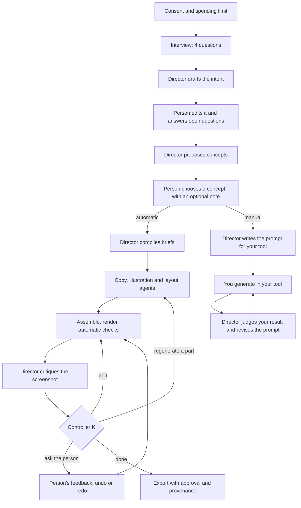

# Media Director

A personal media director built on the One Loop design. You tell it what a piece is for and what it means to you. It turns that into a protected intent, proposes genuinely different concepts, and then either **makes a poster** with specialist AI agents and editing tools (automatic mode), or **writes the final prompt for your own image tool**, such as Midjourney or Ideogram, and judges what that tool produced (manual mode).

The design behind it is [doc 6 of the One Loop series: Director for Personal Media Creation](../docs/one_loop/06_media_creation.md). This is its MVP.

## Contents

- [Spec](#spec)
- [Design](#design)
- [Usage manual](#usage-manual)
- [Development](#development)
- [Known limitations and roadmap](#known-limitations-and-roadmap)

---

## Spec

### Purpose

Make AI-generated visuals that carry one person's intent, personality and feelings, instead of the generic look of AI output, while acting only within what the person allows.

### In scope

| Area | What the MVP does |
|---|---|
| Media | Posters (1080×1350, HTML/SVG) in automatic mode; posters and slide decks in manual mode |
| Interview | Four questions: purpose and audience, feeling, one concrete personal detail, must-include and avoid |
| Intent | A structured intent drafted from the answers, which the person can edit; open questions the person can answer |
| Concepts | Several genuinely different concepts per piece (typically four); the person chooses one, with an optional note |
| Automatic mode | Specialist agents write the copy, draw an SVG illustration and lay out the page; the poster is rendered and checked; the director critiques it; controller K fixes it by editing or regenerating; the person gives feedback, undoes or redoes, and exports |
| Manual mode | A final prompt written for the person's tool (Midjourney, ChatGPT / OpenAI images, Ideogram, Stable Diffusion, FLUX, Gamma, or generic); the person brings back the result and gets a critique and a revised prompt |
| Interfaces | Interactive terminal, local web UI, and one-shot commands |
| Backends | Claude Code CLI (default) or the Anthropic API |

### Out of scope

Video, audio and music; paid image or video generation APIs; a style profile that persists across sessions (planned); automatic slide decks; multiple users; publishing to the web.

### Requirements

**Functional**

1. Nothing is sent to a model until the person consents for the session.
2. Only the person can set or change the intent and standing constraints.
3. Every concept and prompt carries the person's concrete detail and respects their avoid list.
4. Automatic mode fixes each defect the cheapest way that works, editing before regenerating, and asks the person what only they can decide.
5. Every edit can be undone; generated assets are never modified.
6. Export is a separate, explicitly approved step, and it writes a provenance record.
7. Manual mode closes the loop: a result from the person's tool can be judged against the intent and the prompt revised.

**Safety, permissions and cost**

1. Default deny: model spending, sending personal material and exporting each need an explicit grant (One Loop rule R9).
2. Irreversible actions (sending personal material, exporting) also need the person's approval.
3. Specialist agents and tools cannot change goals or request actions; their output is treated as data.
4. Every model call is checked against the spending limit before it runs, and its actual cost is charged after.
5. Generated HTML and SVG are sanitized: no scripts, event handlers, frames or non-font external resources. Rendering may reach only Google Fonts.
6. The web UI listens only on `127.0.0.1` and displays model output as text, never as HTML.

### Models

| Role | Model | Used for |
|---|---|---|
| Director | Claude Opus 5.5 (`claude-opus-5-5`) | Intent, concepts, briefs, critique (reads the screenshot), manual-mode prompts and revisions |
| Specialist agents | Claude Sonnet 5.5 (`claude-sonnet-5-5`) | Copy, SVG illustration, HTML layout (automatic mode only) |

---

## Design

### How the One Loop parts map to the code

| One Loop part | Module | Role here |
|---|---|---|
| W, working state ([doc 3](../docs/one_loop/03_system_design.md#architecture)) | `working.py` | Intent, goal stack, standing constraints and permission envelope. Rendered in full into every director call and never summarized away |
| Source tags and goal gate (R4) | `sources.py` | Every input is tagged person, director, agent, tool or file; only the person can change goals; untrusted content is wrapped as data |
| Grants and action gate (R1, R9) | `gates.py` | Default-deny grants, spending limit, approvals for irreversible actions, narrowed grants for delegates, a log of every decision |
| Scratch, the reversible inner loop (R2) | `timeline.py` | Generated assets stored unchanged, keyed by content hash; a piece is parts plus edit operations; undo, redo and fork |
| G, the director | `director.py`, `prompts.py` | Interview → intent, concepts, briefs, critique by part; manual-mode prompts and revision |
| Specialist agents | `agents.py` | Copy, illustration and layout agents with narrowed briefs; output sanitized and stored with provenance |
| Editing tools | `tools.py` | Deterministic edits applied at assembly time |
| Verifier ladder, lowest rungs | `render.py` | Headless Chrome screenshot plus automatic checks |
| K, the controller | `controller.py` | Edit before regenerating, ask the person when needed, stop on success, round limit or budget |
| E, episodic log | `eventlog.py` | Append-only record of each session with salience tags |
| Orchestration | `session.py` | One session: consent, intent, concepts, production, refinement, manual mode, export, save and resume |
| Model access | `llm.py`, `claude_cli.py` | Claude through the API SDK or the Claude Code CLI, with structured output, images, cost tracking |
| Interfaces | `cli.py`, `interactive.py`, `server.py`, `web/` | One-shot commands, interactive terminal, local web UI |

### Flow



### How a poster is built

A poster is assembled from three assets, each made by one specialist agent:

- **Layout** (HTML): a 1080×1350 page with empty elements marked `data-slot="headline"`, `data-slot="illustration"` and so on. All colors and fonts come from the CSS variables `--bg`, `--fg`, `--accent`, `--muted`, `--font-head` and `--font-body`.
- **Copy** (JSON): text for each slot.
- **Illustration** (SVG): one self-contained image for the illustration slot.

Assembly fills the slots, applies the edit operations as extra CSS rules or copy changes, and sanitizes the result. The stored assets never change, so removing an edit operation undoes it exactly.

**Edit tools**, the cheap and exact fixes:

| Tool | Fields | Effect |
|---|---|---|
| `set_var` | `name`, `value` | Changes a CSS variable, such as a palette color or a font |
| `style` | `slot`, `css` | Adds CSS declarations for one slot |
| `hide` | `slot` | Hides a slot |
| `set_text` | `slot`, `text` | Replaces a slot's text |

Each edit is validated: names must be plain identifiers, and CSS values may not contain braces, tags or at-rules.

**Automatic checks**, run in Chrome on every render:

| Check | Fails when |
|---|---|
| `empty` | A slot has no text or image |
| `out_of_bounds` | A slot extends past the canvas |
| `overflow` | Text overflows its box |
| `tiny_text` | Font size is below 14px |
| `low_contrast` | Text contrast is below the WCAG ratio (4.5:1, or 3:1 for large text) |

### Controller K

For each high- or medium-severity issue in the critique, K routes the fix in order of cost:

1. **Edit** with the tools above. If an edit has no valid operations, K escalates it to regenerating the part.
2. **Regenerate a part** (copy, illustration or layout) with a note added to that agent's brief.
3. **Revise the concept**, or **ask the person**. Both are handed to the person after the fixes K can make on its own.

K stops when the piece serves the intent with no serious issues, when it reaches the round limit (default 2), or when the remaining budget is too small for another round. Every decision is logged.

### Permissions

| Action | Reversibility | Default in a session |
|---|---|---|
| `spend`: model calls | Compensable | Granted up to the spending limit |
| `write_workspace`: assets and timeline | Reversible | Granted for the session folder |
| `send_personal`: your answers or images sent to a model | Irreversible | Granted, but needs your consent for the session |
| `export`: copy a finished piece out | Irreversible | Granted, but needs your approval each time |

Requests carry the authority of whoever made them. Only the person and the director can request actions; a specialist agent or a tool cannot.

### Backends

| Backend | How it calls Claude | Billing | Notes |
|---|---|---|---|
| `claude-code` (default) | `claude -p` with JSON schemas, stream-json input for images, every tool disabled, no saved session, no settings, an empty working folder | Your Claude Code login, for example a subscription | Reported cost is the CLI's figure; on a subscription it is notional, and the spending limit still caps it. API-only options (refusal fallbacks, prompt caching, `max_tokens`) are not passed |
| `api` | Anthropic Python SDK (`beta.messages.parse` / `create` / `stream`) | Per token, through your API key or `ant auth login` profile | Server-side refusal fallback on, system prompt cached, long SVG/HTML outputs streamed |

### Files a session writes

```
workspace/
  assets/                     generated assets, content-addressed, never modified
    <hash>.html|.svg|.json    plus <hash>.<ext>.meta.json: agent, model, brief
  sessions/<session-id>/
    working_state.json        W: intent, constraints, goals, permission envelope
    concept.json              the chosen concept
    timeline.json             every version of the piece, with the cursor
    episodes.jsonl            the episodic log
    costs.json                every model call and gate decision
    render-NN.png / .html     each render
    prompt-NN.json / -<tool>.md   manual-mode prompts
    result-NN.<ext>           images you brought back from your tool
  exports/                    exported posters with <id>.provenance.json
```

`workspace/` is excluded from git.

---

## Usage manual

### Requirements

- macOS or Linux with Python 3.12+ and [uv](https://docs.astral.sh/uv/)
- Google Chrome, for automatic mode (Playwright uses the installed Chrome)
- One of:
  - **Claude Code** (`claude`) installed and logged in, for the default backend
  - An Anthropic API key in `ANTHROPIC_API_KEY`, or the `ant` CLI logged in with `ant auth login`, for `--backend api`

### Install

```sh
cd media_director
uv sync
uv run media-director --help
```

### Quick start

```sh
uv run media-director          # interactive, in the terminal
uv run media-director serve    # web UI at http://127.0.0.1:8765
```

Run these in your own terminal. Interactive mode waits for typed answers.

### Interactive terminal

`uv run media-director` (or `media-director start`) walks through:

1. **Consent.** Answer `y` to allow your answers and images to be sent to Claude. If you answer `n`, nothing is sent.
2. **Spending limit** (default $3, at most $20), **poster or slides**, and **automatic or manual**. Slides always use manual mode.
3. **The interview.** Press Enter to skip a question.
4. **Your intent.** Type a field name (`purpose`, `audience`, `feeling`, `personal_detail`, `must_include`, `avoid`) to edit it, or press Enter to continue. Then answer the director's open questions, or skip them.
5. **Concepts.** Choose one by number, or type `n` for new concepts. Add an optional note, such as "use a warmer amber".
6. **Automatic mode.** The render opens in your image viewer. Then:

   | Key | Action |
   |---|---|
   | `f` | Give feedback or answer the director's questions; K refines again |
   | `u` / `r` | Undo or redo the last change, and re-render |
   | `o` | Open the current render |
   | `e` | Export, after you confirm |
   | `q` | Quit; the session stays saved |

7. **Manual mode.** Choose your tool; the prompt is printed. Then:

   | Key | Action |
   |---|---|
   | `c` | Copy the prompt to the clipboard (macOS) |
   | `r` | Give the path of the image your tool made, plus an optional note, to get a critique and a revised prompt |
   | `t` | Write a prompt for a different tool |
   | `q` | Quit |

### Web UI

```sh
uv run media-director serve [--port 8765] [--backend claude-code|api]
```

Open `http://127.0.0.1:8765` and follow the five steps: Start (spending limit and consent), Tell the director about it, Check the intent, Choose a concept, Make it. The Make it step has two tabs, Automatic and Manual. A progress box in the corner shows each step of a running job, and the header shows spending against your limit. Export asks for confirmation.

### One-shot commands

These suit scripting and quick tests. The answers come from a JSON file (see below), and `--consent` is required.

| Command | What it does |
|---|---|
| `media-director poster --answers FILE [--rounds 2]` | Automatic mode end to end; prints the critique and where the renders are |
| `media-director prompt --answers FILE --target TOOL` | Manual mode: prints and saves the prompt for TOOL |
| `media-director revise --session ID --image FILE [--note TEXT]` | Judges your tool's result and writes a revised prompt |
| `media-director targets` | Lists the tools manual mode supports |

Common options: `--budget` (US$, default 3), `--workspace` (default `workspace`), `--backend` (`claude-code` or `api`), `--consent`.

Answers file (`examples/birthday_poster.json`):

```json
{
  "answers": [
    "What it is for and who will see it",
    "What they should feel, and when",
    "One concrete detail from your life",
    "What it must include, and what you do not want"
  ],
  "concept": 0,
  "medium": "poster"
}
```

`concept` picks a concept by index (default 0). `medium` is `poster` or `slides`.

### Manual mode targets

| Name | Tool | Notes from its conventions |
|---|---|---|
| `midjourney` | Midjourney | Dense description, `--ar`, `--no`, `--style raw`; text added afterwards |
| `chatgpt-image` | ChatGPT / OpenAI images | Natural language, exact text in quotes |
| `ideogram` | Ideogram | Good with text; quoted text by role; negative prompt |
| `stable-diffusion` | Stable Diffusion and similar | Comma phrases plus a negative prompt; text added afterwards |
| `flux` | FLUX | Natural language; exclusions phrased positively |
| `gamma` | Gamma and AI slide tools | A titled outline, one section per slide |
| `generic` | Any other tool | A clear natural-language prompt |

Tool conventions change between versions; the prompt's tips say what to check.

### Cost and time

Measured on the example brief, October 2026:

| Run | Model calls | Time | Cost |
|---|---|---|---|
| Manual prompt | 3 Opus | 1–1.5 min | $0.13 (API) to $0.22 (CLI, notional) |
| Revise one result | 1 Opus with an image | under 1 min | about $0.05 |
| Automatic poster, 2 rounds | 5–6 Opus, 3–6 Sonnet | 4–5 min | about $0.40 |

### Privacy

- Your answers and any images you upload are sent to Claude only after you consent, and only for that session. Resuming a session asks again.
- Manual-mode prompts contain your personal details; check them before pasting into another service.
- Everything else stays in `workspace/` on your machine. Export copies a piece out only after you approve.

### Troubleshooting

| Problem | Fix |
|---|---|
| `the claude command was not found` | Install Claude Code, or use `--backend api` |
| The CLI backend bills an API key | `ANTHROPIC_API_KEY` is set in your shell; unset it to use your Claude Code login |
| `personal material ... needs the person's approval` | Consent was not given; answer `y`, tick the box in the web UI, or pass `--consent` |
| `would exceed limit` | The spending limit is reached; start a session with a higher `--budget` |
| Automatic mode cannot start Chrome | Install Google Chrome |
| `this session is already working on something` (web UI) | Wait for the running step to finish |

---

## Development

```sh
uv run pytest -q
```

The tests (48) run without network or cost: model calls go to scripted fake clients and a fake `claude` runner. Rendering tests use the installed Chrome.

| Test file | Covers |
|---|---|
| `test_core.py` | Source tags, goal gate, grants, timeline, event log, LLM wrapper |
| `test_production.py` | Assembly, sanitizing, rendering and checks, controller K, a full session, a guard that no model-facing schema has free-form objects |
| `test_manual.py` | Manual mode, resume, image formats |
| `test_server.py` | The web API end to end, file restrictions, input checks |
| `test_claude_cli.py` | The Claude Code backend: flags, structured output, images, errors |
| `test_interactive.py` | Interactive mode in both modes, with scripted input |

**Extending**

- *Add a manual-mode tool:* add a `Target` to `TARGETS` in `prompts.py` with its media and conventions.
- *Change models:* edit `DIRECTOR_MODEL` and `SPECIALIST_MODEL` in `llm.py`, and add prices to `PRICES`.
- *Model-facing schemas:* use fixed fields, never a free-form `dict`. Strict structured output returns free-form objects empty; `test_model_facing_schemas_have_no_free_form_objects` enforces this.

---

## Known limitations and roadmap

**Limitations**

- Automatic mode makes posters only; slides go through manual mode.
- The `write_workspace` grant is recorded but individual writes are not yet checked against it; writes stay inside the workspace by construction.
- Sanitizing uses pattern matching rather than a full HTML parser.
- Layouts may load Google Fonts, so rendering needs network access to them.
- Manual-mode tool conventions are written from general knowledge and may lag behind the tools.
- On the Claude Code backend, costs are the CLI's notional figures, and API-only options are not used.

**Roadmap** (the remaining MVP steps)

1. **Memory and sleep:** a personal style profile built from your choices, feedback and results, so each piece starts closer to your taste.
2. **Automatic slide decks.**
3. **Evaluation:** the same briefs through a plain one-prompt generator versus the director, judged blind, with the cost per accepted piece and the share of defects fixed by editing.
